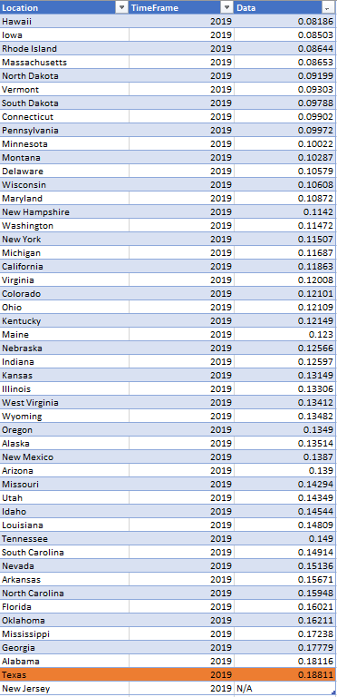
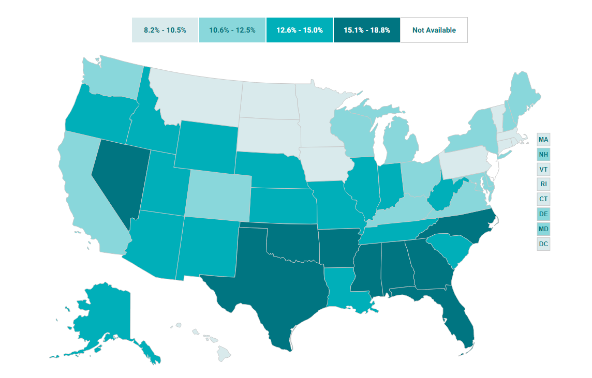

# Percent of adults who report needing to see a doctor in past year but could not due to cost

# Health

### Primary Indicator

### Goal

Population health

Texans live long, healthy, and productive lives

### Value

| Year |  Value      | Rank        | Previous Year | Previous Value | Previous Rank | Trend | 
| ----------- | ----------- | ----------- | ----------- | ----------- | ----------- | -----------|
|    2019     | 18.8%       |  50        |       2018   |    16.8%     | 48         |   down       | 

### Data

### Source

[Shadac - State Health Compare](http://statehealthcompare.shadac.org/map/178/percent-of-adults-who-could-not-get-medical-care-when-needed-due-to-cost-by-total-2011-to-2019#a/27/211)

### Notes

### Indicator Page

[Indicator Link](https://indicators.texas2036.org/indicator/137)

### DataLab Page

[DataLab Link](https://datalab.texas2036.org/bwhqgjc/behavioral-risk-factor-surveillance-system-brfss-prevalence-data?accesskey=aoasocg)