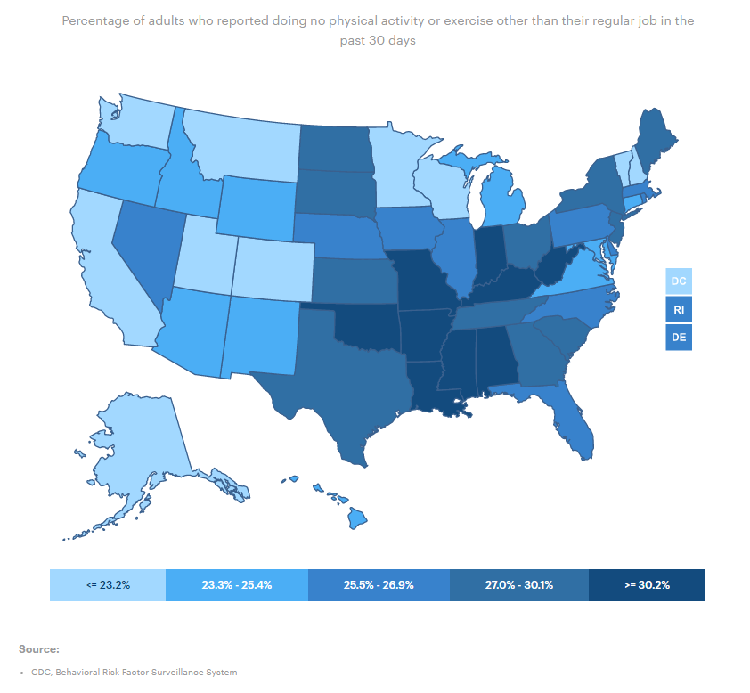

# Physical inactivity
Percent of adults who reported no physical activity
## Health Outcomes
### Goal: Public health
Texans and their communities are empowered to adopt healthy lifestyles
### Type: Secondary indicator
Updated: yes
Data Release Date: 

### Value

| Year      |  Value      | Rank        | Previous Year | Previous Value | Previous Rank | Trend | 
| ----------- | ----------- | ----------- | ----------- | ----------- | ----------- | -----------|
|   2020       | 27.2%       |  32         |      2019   |   25.6%      |      35    |    flat       | 

### Data

### Source

[AmericasHealthRankings](https://www.americashealthrankings.org/explore/annual/measure/Sedentary/state/TX)

### Notes

### Indicator Page

N/A

### DataLab Page

[DataLab Link](https://datalab.texas2036.org/bwhqgjc/behavioral-risk-factor-surveillance-system-brfss-prevalence-data?accesskey=sryykne)