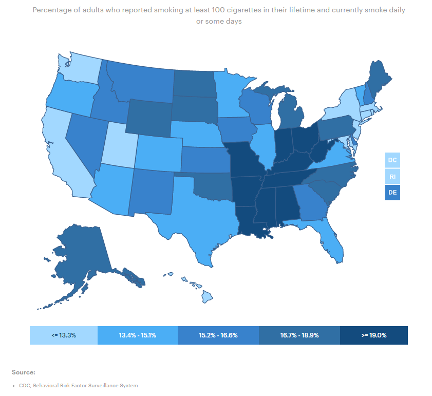
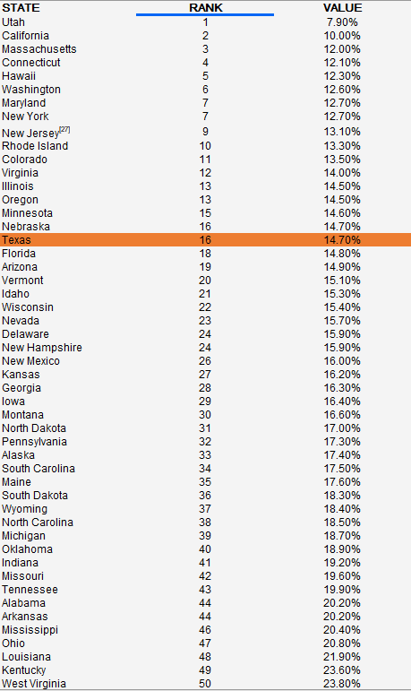

# Percent of adults who reported smoking daily or some days

## Health

### Primary Indicator

### Goal

Population health

Texans live long, healthy, and productive lives

### Value

| Year      |  Value      | Rank        | Previous Year | Previous Value | Previous Rank | Trend | 
| ----------- | ----------- | ----------- | ----------- | ----------- | ----------- | -----------|
|   2020       | 14.7%       |  16         |      2019   |   14.4%      |      12    |    down       | 

### Data

### Source

[AmericasHealthRankings](https://www.americashealthrankings.org/explore/annual/measure/Smoking/state/TX)

### Notes

### Indicator Page

[Indicator Link](https://indicators.texas2036.org/indicator/103)

### DataLab Page

[DataLab Link](https://datalab.texas2036.org/bwhqgjc/behavioral-risk-factor-surveillance-system-brfss-prevalence-data?accesskey=aaukuob)