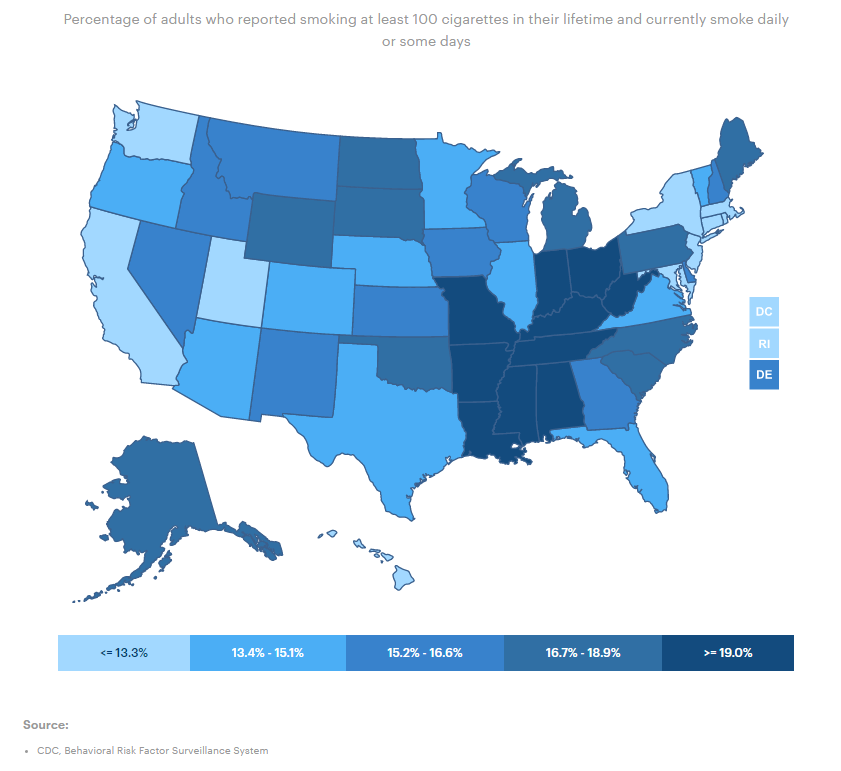
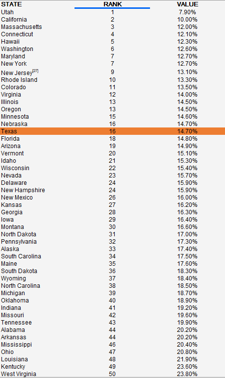

# Smoking

Percent of adults who reported smoking daily or some days

## Health Outcomes

### Goal: Public health

Texans and their communities are empowered to adopt healthy lifestyles

### Type: Primary indicator

Updated: yes

Data Release Date: 

Comparisons: States

----

Date: 2019

Latest Value: 14.7%

State Rank: 16

Peer Rank: 7

----

Previous Date:  2018

Previous Value: 14.4%

Previous State Rank: 12

Previous Peer Rank: 4

----

Metric Trend: down

Target: Top 6

Baseline: 14%

Target Value: 15%

Previous Trend: Flat

<!--### Value

| Year      |  Value      | Rank        | Previous Year | Previous Value | Previous Rank | Trend | 
| ----------- | ----------- | ----------- | ----------- | ----------- | ----------- | -----------|
|   2020       | 14.7%       |  16         |      2019   |   14.4%      |      12    |    down       | 

-->
### Data

### Source

[AmericasHealthRankings](https://www.americashealthrankings.org/explore/annual/measure/Smoking/state/TX)

### Notes

### Indicator Page

[Indicator Link](https://indicators.texas2036.org/indicator/103)

### DataLab Page

[DataLab Link](https://datalab.texas2036.org/bwhqgjc/behavioral-risk-factor-surveillance-system-brfss-prevalence-data?accesskey=aaukuob)
