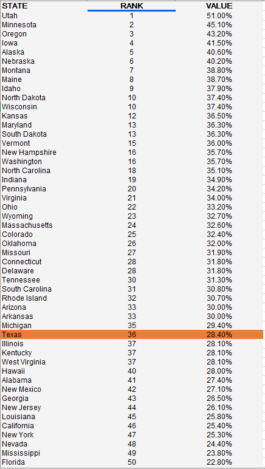

# Percent of adults who volunteer

## Health

### Primary Indicator

### Goal

Population health

Texans live long, healthy, and productive lives

### Value

| Year      |  Value      | Rank        | Previous Year | Previous Value | Previous Rank | Trend | 
| ----------- | ----------- | ----------- | ----------- | ----------- | ----------- | -----------|
|   2020       | 28.4%       |  36         |      N/A   |   N/A      |      N/A    |    flat       | 

### Data

### Source

[AmericasHealthRankings](https://www.americashealthrankings.org/explore/annual/measure/volunteerism/state/TX)

### Notes

### Indicator Page

N/A

### DataLab Page

N/A