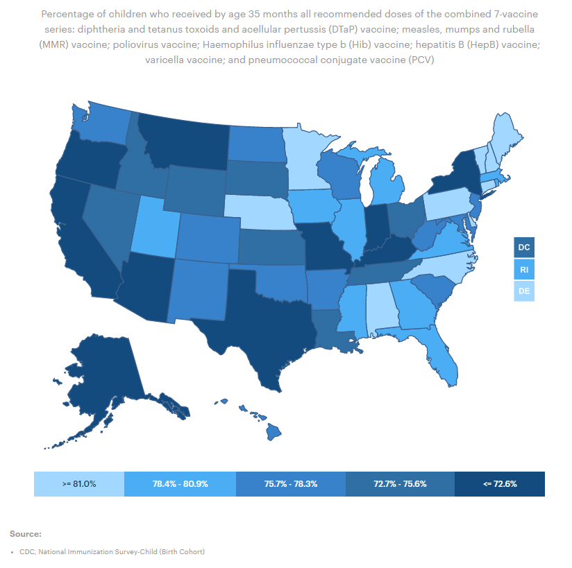
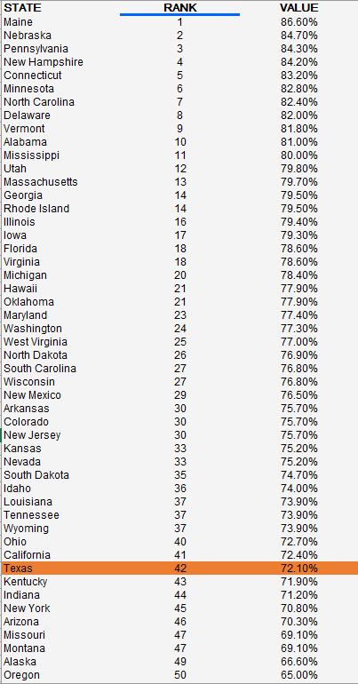

# Childhood Immunizations

Percent of children ages 19-35 months who received recommended vaccines

## Health Outcomes

### Goal: Value-driven system

Texas has a high-value health care system that optimizes cost and delivers results

### Type: Primary indicator

Updated: yes

Data Release Date: 

Comparisons: States

----

Date: 2020

Latest Value: 72.1%

State Rank: 43

Peer Rank: 11

----

Previous Date:  2017

Previous Value: 67.8%

Previous State Rank:   41

Previous Peer Rank: 8

----
Metric Trend: down

Target: 

Baseline: 

Target Value: 

Previous Trend: 

### Value

|Year         |  Value      | Rank        | Previous Year| Previous Value | Previous Rank  | Trend| 
| ----------- | ----------- | ----------- | ----------- | ----------- | ----------- | -----------|
|    2020     |    72.1%     |     42      |    2019      |     67.8     |     41     |   flat     |

### Data

### Source

<!-- https://www.dshs.texas.gov/immunize/coverage/NIS/

https://www.cdc.gov/vaccines/imz-managers/coverage/childvaxview/interactive-reports/index.html -->

[AmericasHealthRankings](https://www.americashealthrankings.org/explore/annual/measure/Immunize_b/state/TX)

### Notes

2020 Number:

Definition: Percentage of children who received by age 35 months all recommended doses of the combined 7-vaccine series: diphtheria and tetanus toxoids and acellular pertussis (DTaP) vaccine; measles, mumps and rubella (MMR) vaccine; poliovirus vaccine; Haemophilus influenzae type b (Hib) vaccine; hepatitis B (HepB) vaccine; varicella vaccine; and pneumococcal conjugate vaccine (PCV)
Data Source & Year(s): CDC, National Immunization Survey-Child (Birth Cohort), 2016-2017
Suggested Citation: America's Health Rankings analysis of CDC, National Immunization Survey-Child (Birth Cohort), United Health Foundation, AmericasHealthRankings.org, Accessed 2021.

2019:

Definition: Percentage of children ages 19-35 months who received recommended doses of diphtheria, tetanus and acellular pertussis (DTaP); measles, mumps and rubella (MMR); polio; Haemophilus influenzae type b (Hib); hepatitis B; varicella; and pneumococcal conjugate vaccines
Data Source & Year(s): CDC, National Immunization Survey-Child, 2017
Suggested Citation: America's Health Rankings analysis of CDC, National Immunization Survey-Child, United Health Foundation, AmericasHealthRankings.org, Accessed 2021.

### Indicator Page

[Indicator Link](https://indicators.texas2036.org/indicator/59)

### DataLab Page

[DataLab Link](https://datalab.texas2036.org/olxykof/health-indicators-on-us-states-2017?country=1000440&indicator=1000730&accesskey=szxjfqb)

