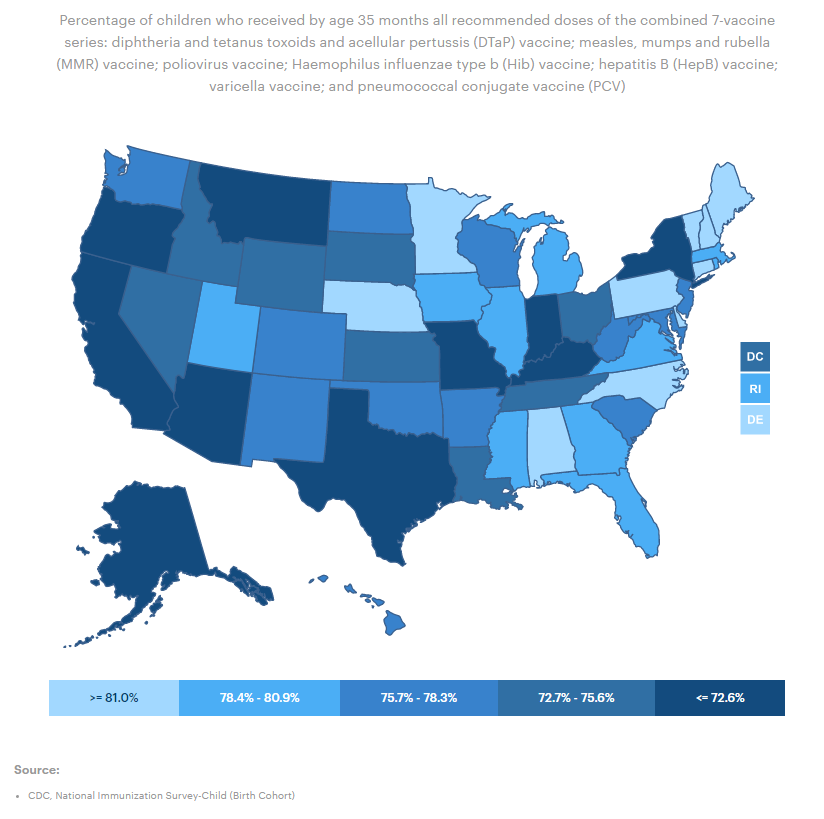

# Immunizations
Percent of children ages 19-35 months who received recommended vaccines
## Health Outcomes
### Goal: Value-driven system
Texas has a high-value health care system that optimizes cost and delivers results
### Type: Primary indicator
Updated: yes
Data Release Date: 

Comparisons: States

Date: 2020

Latest Value: 72.1% 

State Rank: 42

Peer Rank: 

Previous Date: 2019

Previous Value: 67.8

Previous State Rank: 41

Metric Trend: flat

Target: 

Baseline: 

Previous Target Value: 

Previous Trend: 

Previous Peer Rank: 

Previous State Rank (og): 

### Value

|Year         |  Value      | Rank        | Previous Year| Previous Value | Previous Rank  | Trend| 
| ----------- | ----------- | ----------- | ----------- | ----------- | ----------- | -----------|
|    2020     |    72.1%     |     42      |    2019      |     67.8     |     41     |   flat     |

### Data

### Source

<!-- https://www.dshs.texas.gov/immunize/coverage/NIS/

https://www.cdc.gov/vaccines/imz-managers/coverage/childvaxview/interactive-reports/index.html -->

[AmericasHealthRankings](https://www.americashealthrankings.org/explore/annual/measure/Immunize_b/state/TX)

### Notes

### Indicator Page

[Indicator Link](https://indicators.texas2036.org/indicator/59)

### DataLab Page

[DataLab Link](https://datalab.texas2036.org/olxykof/health-indicators-on-us-states-2017?country=1000440&indicator=1000730&accesskey=szxjfqb)

