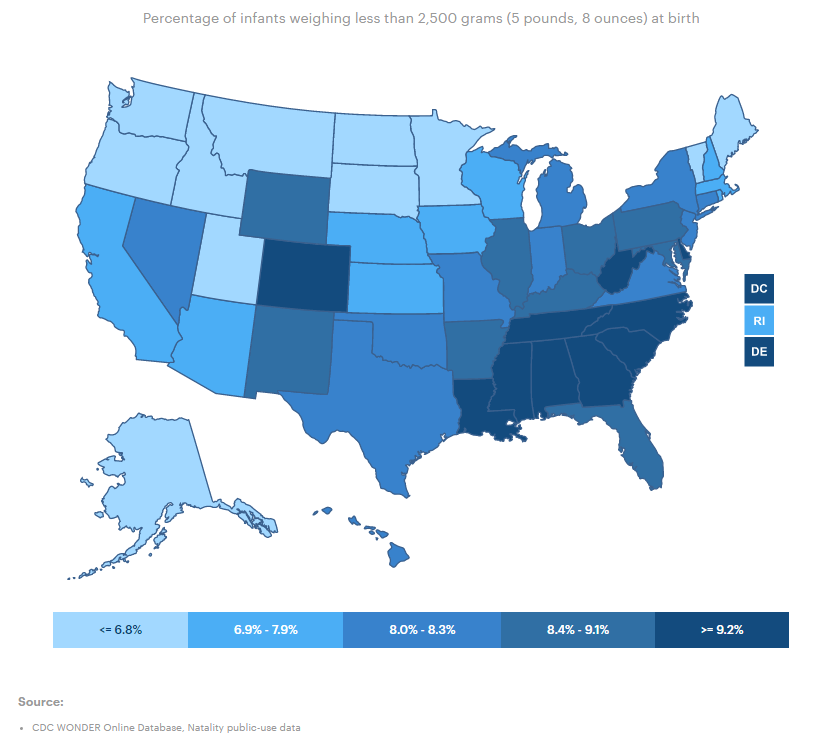
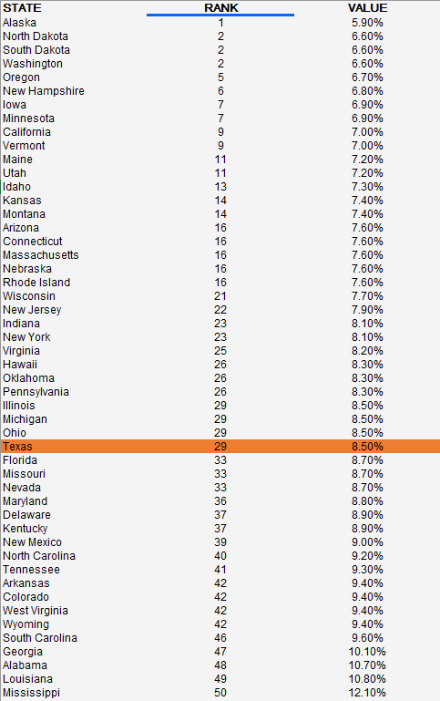

# Low birthweight

Percent of infants weighing 5.5 lb at birth

## Health Outcomes

### Goal: Public health

Texans live long, healthy, and productive lives

### Type: Primary indicator

Updated: yes

Data Release Date: 

Comparisons: States

----

Date: 2020

Latest Value: 8.5

State Rank: 29

Peer Rank: 6

----

Previous Date:  2019

Previous Value: 8.4

Previous State Rank:   6

Previous Peer Rank: 5

----
Metric Trend: flat

Target: Top 3

Baseline: 8.4%

Target Value: 8.1%

Previous Trend: Worsening

### Value

| Year      |  Value      | Rank        | Previous Year | Previous Value | Previous Rank | Trend | 
| ----------- | ----------- | ----------- | ----------- | ----------- | ----------- | -----------|
|   2020       | 8.5%       |  29         |      2019   |   8.4%      |     26      |    flat       | 

### Data

### Source

[AmericasHealthRankings](https://www.americashealthrankings.org/explore/annual/measure/birthweight/state/ALL)

### Notes

### Indicator Page

[Indicator Link](https://indicators.texas2036.org/indicator/54)

### DataLab Page

[DataLab Link](https://datalab.texas2036.org/duzemig/low-birthweight-us-state-1997-2011-source-nvss?accesskey=bspqzdf)
