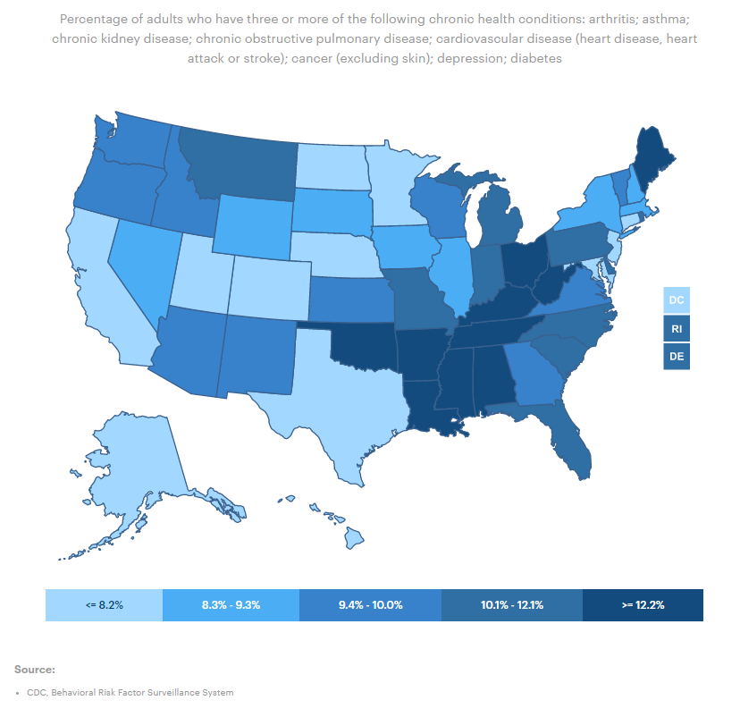

# Percent of population who report having one or more of the following chronic conditions—diabetes, cardiovascular disease, and asthma

## Health

### Primary Indicator

### Goal

Population health

Texans live long, healthy, and productive lives

### Value

| Year      |  Value      | Rank        | Previous Year | Previous Value | Previous Rank | Trend | 
| ----------- | ----------- | ----------- | ----------- | ----------- | ----------- | -----------|
|   2020       | 8.1%       |  9         |      2019   |   9.6%      |     N/A      |    up       | 

### Data

### Source

[AmericasHealthRankings](https://www.americashealthrankings.org/explore/annual/measure/CHC/state/TX)

### Notes

### Indicator Page

N/A

### DataLab Page

[DataLab Link](https://datalab.texas2036.org/bwhqgjc/behavioral-risk-factor-surveillance-system-brfss-prevalence-data?accesskey=yaigzre)