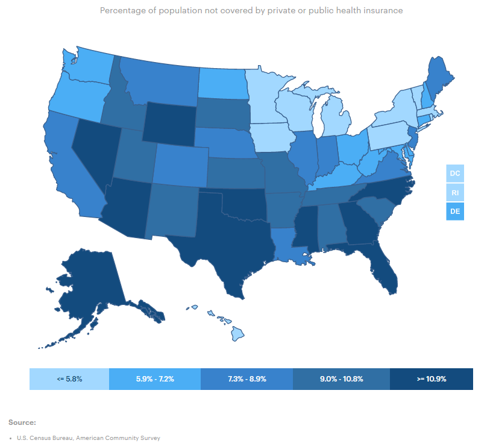
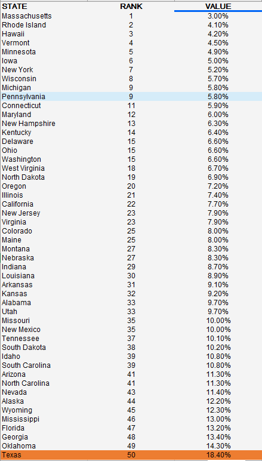

# Percent of population without health insurance

## Health

### Primary Indicator

### **Goal**

Postsecondary

Texas students earn a postsecondary credential to access the jobs of today and tomorrow

### Value

|Year         |  Value      | Rank        | Previous Year| Previous Value | Previous Rank  | Trend| 
| ----------- | ----------- | ----------- | ----------- | ----------- | ----------- | -----------|
|    2020     |   18.7%     |      50     |     2019    |   17.5%     |   50        |      flat  |

### Data

### Source

[AmericasHealthRankings](https://www.americashealthrankings.org/explore/annual/measure/HealthInsurance/state/ALL)

### Notes

### Indicator Page

[Indicator Link](https://indicators.texas2036.org/indicator/50)

### DataLab Page

[DataLab Link](https://datalab.texas2036.org/udfegke/health-insurance-coverage-status-and-type-of-coverage-by-state-united-states?accesskey=yurlzib)