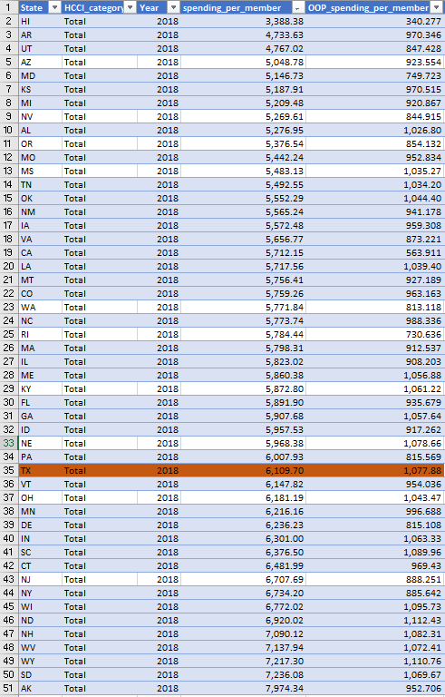

# Personal Health Expenditures

something

## Health Affordability

### Goal: Affordability of health care

Texans are able to afford the basic health care they need

### Type: Secondary indicator

Updated: yes

Data Release Date: 

Comparisons: States

----

Date: 2018

Latest Value: 1077.88

State Rank: 43

Peer Rank: 12

----

Previous Date:  2017

Previous Value: 1032.58

Previous State Rank:   12

Previous Peer Rank: 12

----
Metric Trend: 

Target: 

Baseline: 

Target Value: 

Previous Trend: 

### Value

|Year         |  Value      | Rank        | Previous Year| Previous Value | Previous Rank  | Trend| 
| ----------- | ----------- | ----------- | ----------- | ----------- | ----------- | -----------|
|    2018     |  $1,077.88  |      44     |     2017    |             |             |            |

### Data

### Source

[HCCI](https://healthcostinstitute.org/)

### Notes

### Indicator Page

N/A

### DataLab Page

N/A
