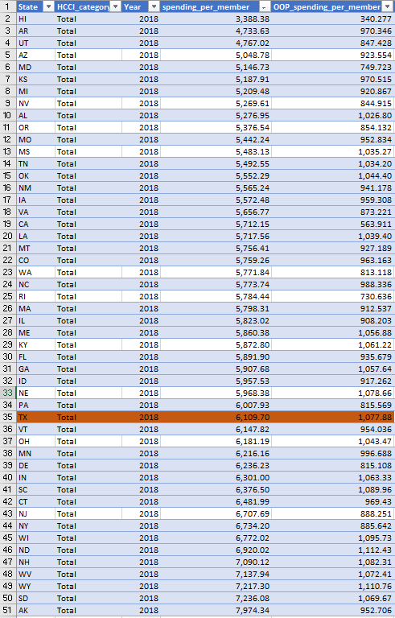

# Personal Health Expenditures

something

## Health Affordability

### Goal: Affordability of health care

Texans are able to afford the basic health care they need

### Type: Secondary indicator

Updated: yes

Data Release Date: 

Comparisons: States

### Value

|Year         |  Value      | Rank        | Previous Year| Previous Value | Previous Rank  | Trend| 
| ----------- | ----------- | ----------- | ----------- | ----------- | ----------- | -----------|
|    2020     |  $1,077.88  |      34     |     2019    |             |             |            |

### Data

### Source

[HCCI](https://healthcostinstitute.org/)

### Notes

### Indicator Page

N/A

### DataLab Page

N/A
