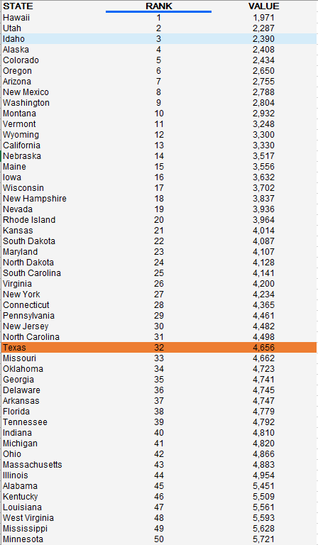

# Preventable hospital admissions

Potentially avoidable hospital visits among adults per 1,000 insurance enrollees
## Health Outcomes
### Goal: Value-driven system
Texas has a high-value health care system that optimizes cost and delivers results
### Type: Primary indicator
Updated: yes
Data Release Date: 

### Value

|Year         |  Value      | Rank        | Previous Year| Previous Value | Previous Rank  | Trend| 
| ----------- | ----------- | ----------- | ----------- | ----------- | ----------- | -----------|
|    2020    |    4656      |     32     |   2019       |    53.2     |   34        |     up    |

### Data

### Source

[AmericasHealthRankings](https://www.americashealthrankings.org/explore/annual/measure/PrevHosp/state/ALL)

### Notes

### Indicator Page

[Indicator Link](https://indicators.texas2036.org/indicator/104)

### DataLab Page

[DataLab Link](https://datalab.texas2036.org/mskvxdg/america-s-health-rankings-annual-report?accesskey=azynetc)

