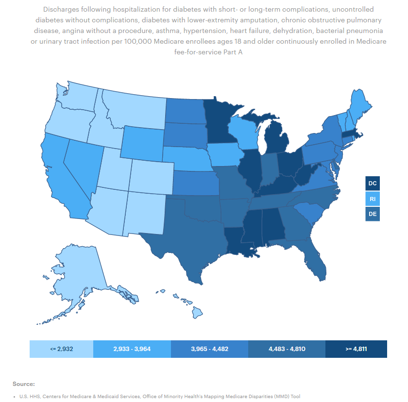
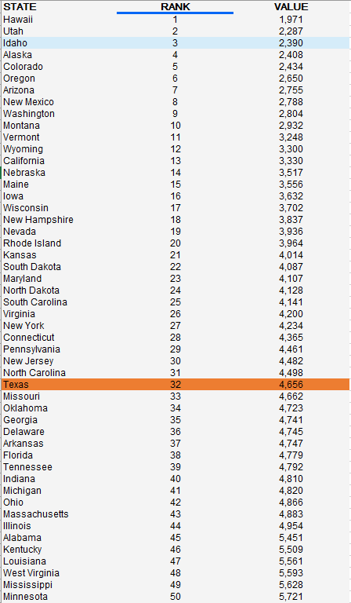

# Preventable hospital admissions

Potentially avoidable hospital visits among adults per 1,000 insurance enrollees

## Health Outcomes

### Goal: Value-driven system

Texas has a high-value health care system that optimizes cost and delivers results

### Type: Primary indicator

Updated: yes

Data Release Date: 

Comparisons: States

----

Date: 2017

Latest Value: 6.9

State Rank: 34

Peer Rank: 9

----

Previous Date:  2016

Previous Value: 7.2

Previous State Rank: 36

Previous Peer Rank: 9

----

Metric Trend: flat

Target: Top 3

Baseline: 7.2

Target Value: 5.9

Previous Trend: Mixed

### Value

|Year         |  Value      | Rank        | Previous Year| Previous Value | Previous Rank  | Trend| 
| ----------- | ----------- | ----------- | ----------- | ----------- | ----------- | -----------|
|    2020    |    4656      |     32     |   2019       |    53.2     |   34        |     up    |

### Data
<!-- 

 -->

### Source

[Common Wealth Fund](https://datacenter.commonwealthfund.org/topics/preventable-hospitalizations-ages-18-64)

<!-- [AmericasHealthRankings](https://www.americashealthrankings.org/explore/annual/measure/PrevHosp/state/ALL) -->

### Notes

<!-- Latest number:

U.S. HHS, Centers for Medicare & Medicaid Services, Office of Minority Health's Mapping Medicare Disparities (MMD) Tool , 2018

Discharges following hospitalization for diabetes with short- or long-term complications, uncontrolled diabetes without complications, diabetes with lower-extremity amputation, chronic obstructive pulmonary disease, angina without a procedure, asthma, hypertension, heart failure, dehydration, bacterial pneumonia or urinary tract infection per 100,000 Medicare enrollees ages 18 and older continuously enrolled in Medicare fee-for-service Part A

Previous number:

The Dartmouth Atlas of Health Care, 2015

Number of discharges for ambulatory care-sensitive conditions per 1,000 Medicare enrollees -->

### Indicator Page

[Indicator Link](https://indicators.texas2036.org/indicator/104)

### DataLab Page

[DataLab Link](https://datalab.texas2036.org/mskvxdg/america-s-health-rankings-annual-report?accesskey=azynetc)

