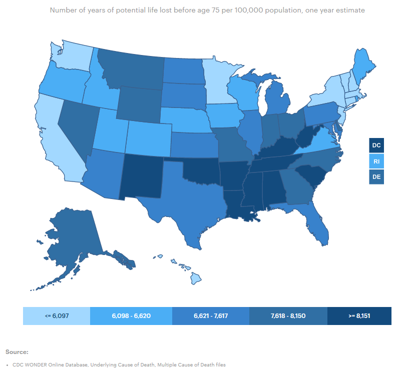

# Mortality amenable to health care

Premature death from treatable medical conditions deaths per 100,000 population

## Health Outcomes

### Goal: Public health

Texans live long, healthy, and productive lives

### Type: Primary indicator

Updated: yes

Data Release Date: 

Comparisons: States

Date: 2020

Latest Value: 7,126 

State Rank: 21

Peer Rank: 

Previous Date: 2019

Previous Value: 7,240

Previous State Rank: 22

Metric Trend: flat

Target: Top 3

Baseline: 95

Previous Target Value: 71

Previous Trend: Flat

Previous Peer Rank: 10

Previous State Rank (og): 36

### Value

| Year      |  Value      | Rank        | Previous Year | Previous Value | Previous Rank | Trend | 
| ----------- | ----------- | ----------- | ----------- | ----------- | ----------- | -----------|
|   2020       | 7,126      |  21         |      2019   |   7,240      |      22    |    flat       | 

### Data

### Source

[AmericasHealthRankings](https://www.americashealthrankings.org/explore/annual/measure/YPLL/state/TX)

### Notes

### Indicator Page

N/A

### DataLab Page

[DataLab Link](https://datalab.texas2036.org/fywtqfb/texas-county-health-ranking?accesskey=ihwiku)