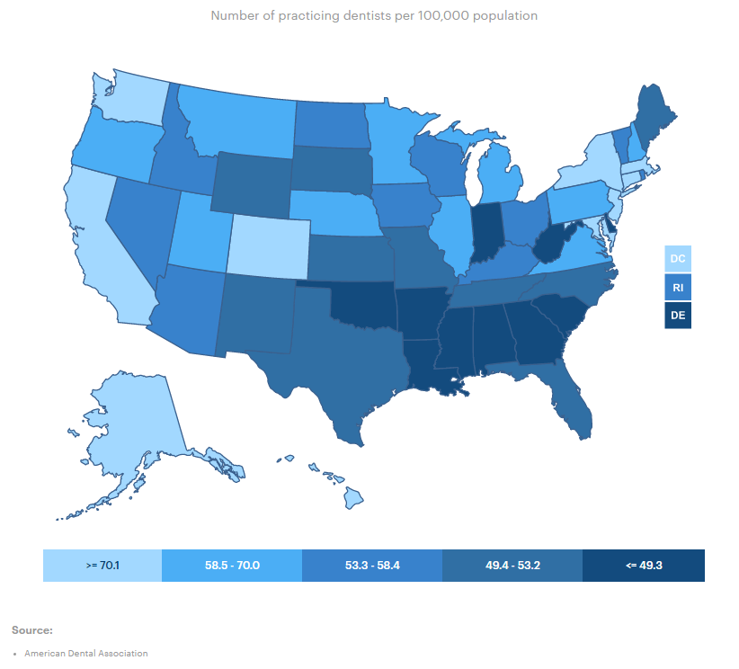
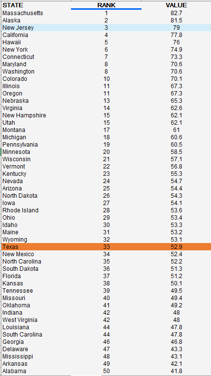

# Availability of dental health care providers

Ratio of population to dental health providers in a county

## Health Access

### Goal: Availability of health care

Texans have access to basic health care

### Type: Secondary indicator

Updated: yes

Data Release Date: 

Comparisons: States

----

Date: 2020

Latest Value: 51.7 

State Rank: 39

Peer Rank: 

----

Previous Date: 2019

Previous Value: 52.9

Previous State Rank: 33

Previous Peer Rank: 

----
Metric Trend: down

Target: 

Baseline: 

Target Value: 

Previous Trend: 

### Value

|Year         |  Value      | Rank        | Previous Year| Previous Value | Previous Rank  | Trend| 
| ----------- | ----------- | ----------- | ----------- | ----------- | ----------- | -----------|
|   2020      |    51.7     |    39       |    2019     |    52.9     |    33   |    down    |

### Data

### Source

[AmericasHealthRankings](https://www.americashealthrankings.org/explore/annual/measure/dental_provider/state/ALL?edition-year=2020)

### Notes

### Indicator Page

[Indicator Link](https://indicators.texas2036.org/indicator/49)

### DataLab Page

[DataLab Link](https://datalab.texas2036.org/fywtqfb/texas-county-health-ranking?region=1000000&indicator=1000370&measure=1000020&group=1000000&accesskey=aktoixg)

