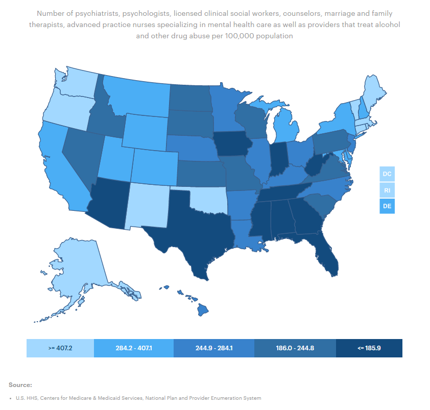
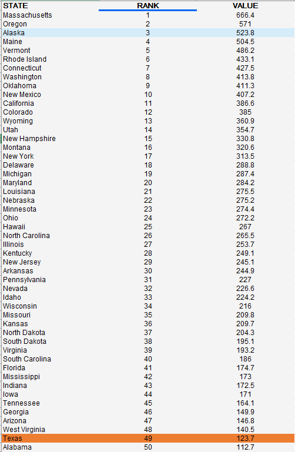

# Ratio of population to mental health providers in a county

## Health

### Primary Indicator

### **Goal**

Health Access

Texans have access to basic health care

### Value

|Year         |  Value      | Rank        | Previous Year| Previous Value | Previous Rank  | Trend| 
| ----------- | ----------- | ----------- | ----------- | ----------- | ----------- | -----------|
|    2020     |   123.7     |    49       |    2019    |    111.8      |   49     |    flat   |

### Data

### Source

[AmericasHealthRankings](https://www.americashealthrankings.org/explore/annual/measure/MHP/state/ALL)

### Notes

### Indicator Page

[Indicator Link](https://indicators.texas2036.org/indicator/48)

### DataLab Page

[DataLab Link](https://datalab.texas2036.org/fywtqfb/texas-county-health-ranking?accesskey=lkaiqy)

