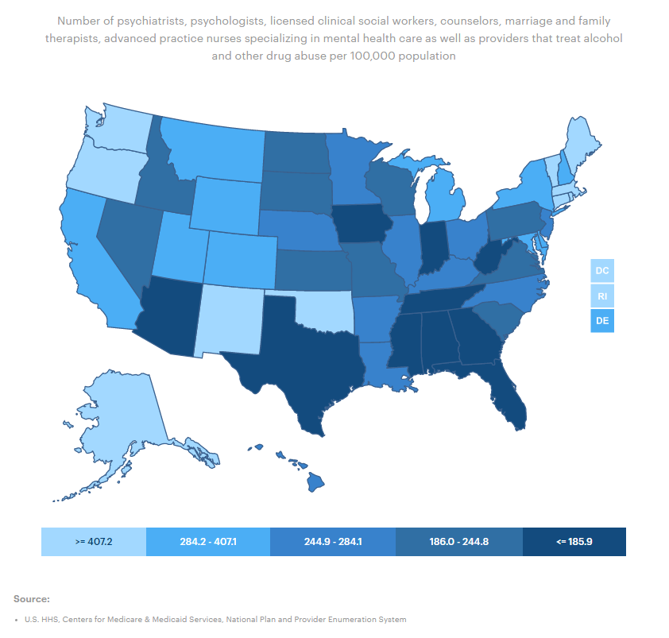
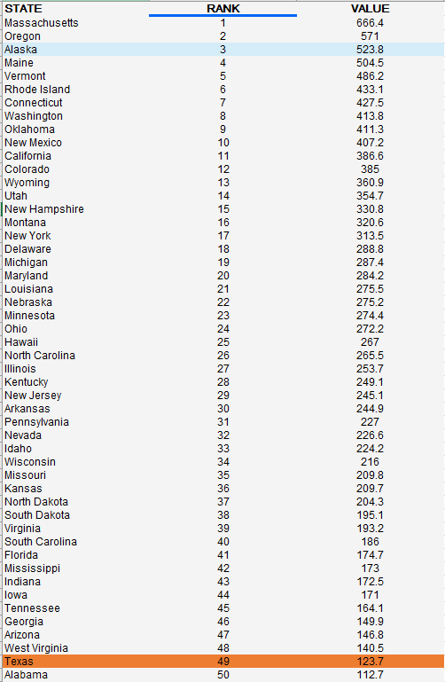

# Availability of mental health care providers

Ratio of population to mental health providers in a county

## Health Access

### Goal: Availability of health care

Texans have access to basic health care

### Type: Primary indicator

Updated: yes

Data Release Date: 

Comparisons: States

----

Date: 2020

Latest Value: 830:1

State Rank: 50

Peer Rank: 12

----

Previous Date:  2019

Previous Value: 880:1

Previous State Rank:  50

Previous Peer Rank: 12

----

Metric Trend: flat

Target: Top 3

Baseline: 960:1

Target Value: 310:1

Previous Trend: Flat

### Value

<!-- |Year         |  Value      | Rank        | Previous Year| Previous Value | Previous Rank  | Trend| 
| ----------- | ----------- | ----------- | ----------- | ----------- | ----------- | -----------|
|    2020     |   123.7     |    49       |    2019    |    111.8      |   49     |    flat   | -->

### Data

### Source

<!-- [AmericasHealthRankings](https://www.americashealthrankings.org/explore/annual/measure/MHP/state/ALL) -->

[CountyHealthRankings](https://www.countyhealthrankings.org/sites/default/files/media/document/CHR2021_TX.pdf)

### Notes

### Indicator Page

[Indicator Link](https://indicators.texas2036.org/indicator/48)

### DataLab Page

[DataLab Link](https://datalab.texas2036.org/fywtqfb/texas-county-health-ranking?accesskey=lkaiqy)

