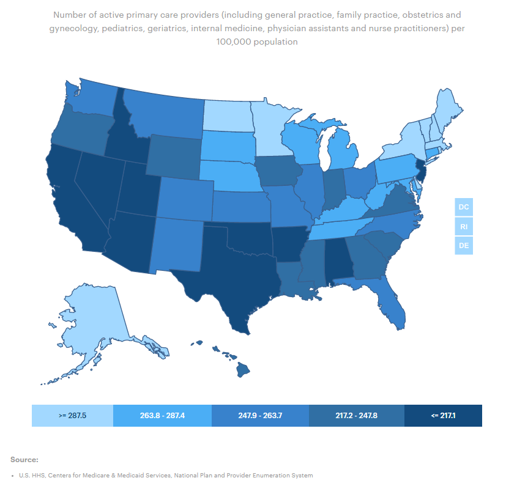
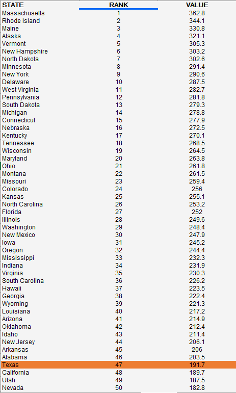

# Availability of primary care providers 

Ratio of population to primary care providers in a county

## Health Access

### Goal: Availability of health care

Texans have access to basic health care

### Type: Primary indicator

Updated: yes

Data Release Date: 

Comparisons: States

----

Date: 2018

Latest Value: 1640:1

State Rank: 50

Peer Rank: 12

----

Previous Date:  2017

Previous Value: 1640:1

Previous State Rank: 50

Previous Peer Rank: 12

----
Metric Trend: flat

Target: Top 3

Baseline: 1,660:1

Target Value: 1,230:1

Previous Trend: Flat

<!--### Value

<!-- |Year         |  Value      | Rank        | Previous Year| Previous Value | Previous Rank  | Trend| 
| ----------- | ----------- | ----------- | ----------- | ----------- | ----------- | -----------|
|   2020      |    191.7     |    47     |    2019     |      113.5    |   45    |    up   | -->

-->
### Data

### Source

[CountyHealthRankings](https://www.countyhealthrankings.org/sites/default/files/media/document/CHR2021_TX.pdf)

<!-- [AmericasHealthRankings](https://www.americashealthrankings.org/explore/annual/measure/PCP_NPPES/state/ALL?edition-year=2020) -->

### Notes

### Indicator Page

[Indicator Link](https://indicators.texas2036.org/indicator/101)

### DataLab Page

[DataLab Link](https://datalab.texas2036.org/fywtqfb/texas-county-health-ranking?accesskey=rzotuvb)
