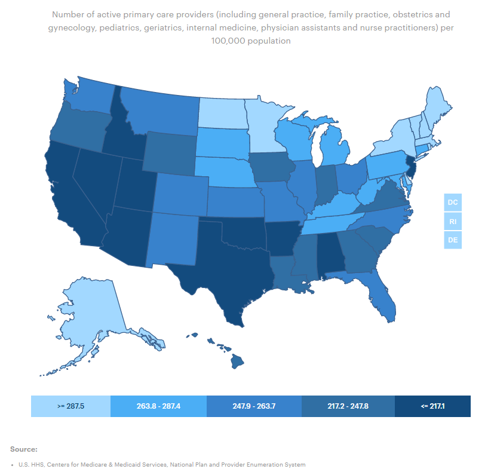
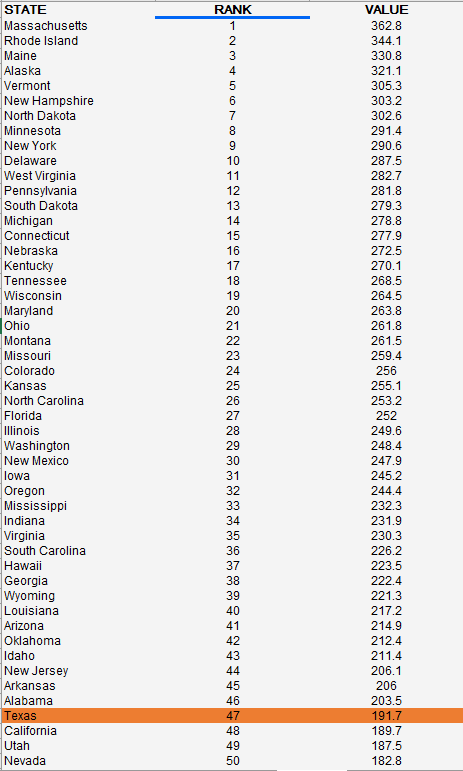

# Availability of physical health care providers 

Ratio of population to primary care providers in a county

## Health Access

### Goal: Availability of health care

Texans have access to basic health care

### Type: Primary indicator

Updated: yes

Data Release Date: 

Comparisons: States

### Value

|Year         |  Value      | Rank        | Previous Year| Previous Value | Previous Rank  | Trend| 
| ----------- | ----------- | ----------- | ----------- | ----------- | ----------- | -----------|
|   2020      |    191.7     |    47     |    2019     |      113.5    |   45    |    up   |

### Data

### Source

[AmericasHealthRankings](https://www.americashealthrankings.org/explore/annual/measure/PCP_NPPES/state/ALL?edition-year=2020)

### Notes

### Indicator Page

[Indicator Link](https://indicators.texas2036.org/indicator/101)

### DataLab Page

[DataLab Link](https://datalab.texas2036.org/fywtqfb/texas-county-health-ranking?accesskey=rzotuvb)