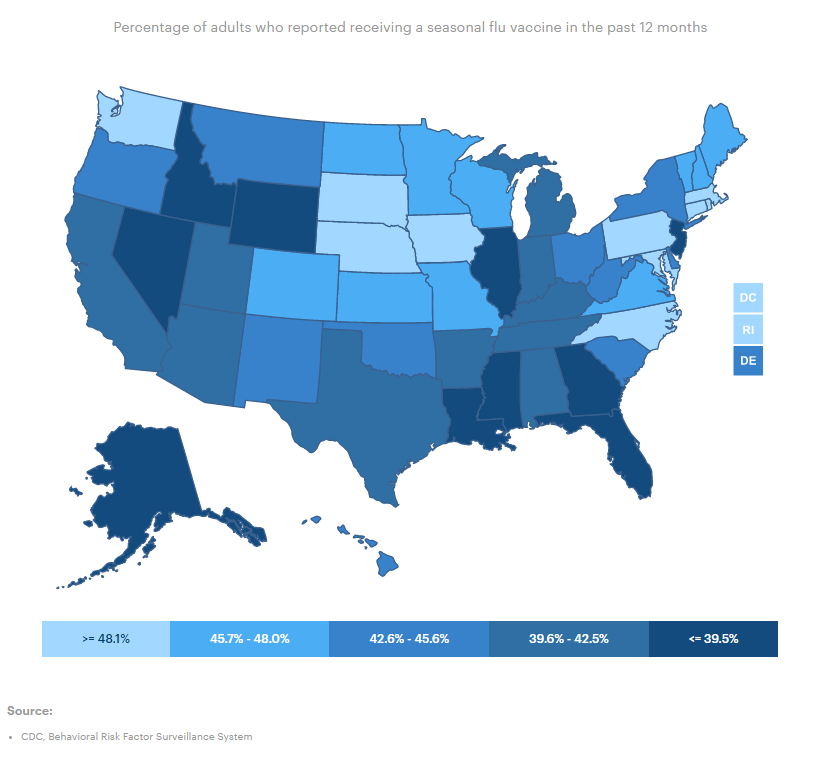
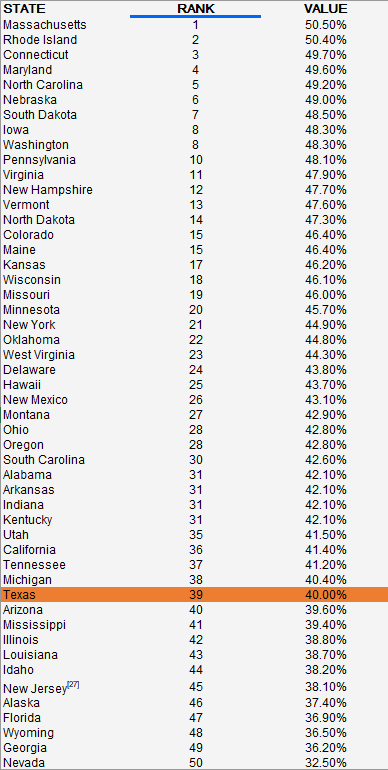

# Adult Vaccinations

the percentage of adults who reported that they received the flu vaccine within the past 12 months

## Health Outcomes

### Goal: Public health

Texans and their communities are empowered to adopt healthy lifestyles

### Type: Primary indicator

Updated: yes

Data Release Date: 

Comparisons: States

### Value

|Year         |  Value      | Rank        | Previous Year| Previous Value | Previous Rank  | Trend | 
| ----------- | ----------- | ----------- | ----------- | ----------- | ----------- | -----------|
|     2020    |   46%       |     39      |    2019     |     44%      |            |    up      |

### Data

### Source

[County Health Rankings](https://www.countyhealthrankings.org/sites/default/files/media/document/CHR2021_TX.pdf)

[County Health Rankings - 2020](https://www.countyhealthrankings.org/sites/default/files/media/document/CHR2020_TX_0.pdf)

[AmericasHealthRankings](https://www.americashealthrankings.org/explore/annual/measure/flu_vaccine/state/ALL)

### Notes

### Indicator Page

[Indicator Link](https://indicators.texas2036.org/indicator/138)

### DataLab Page

N/A

