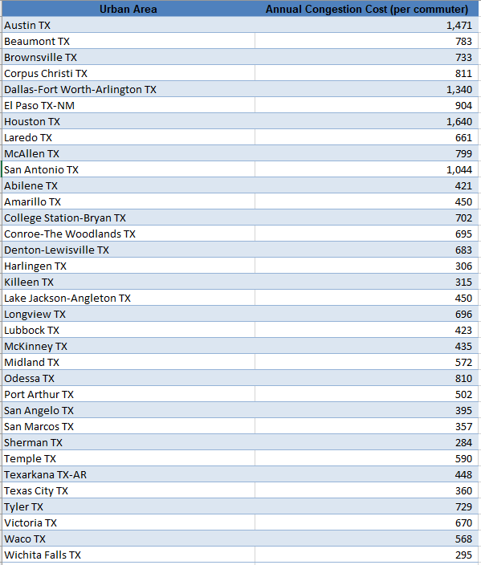

# Annual cost of time lost and fuel spent from passenger car delays, per auto commuter

## Infrastructure

### Primary Indicator

### Goal

Mobility of individuals

Texans can travel to their destinations effectively and efficiently

### Value

| Year      |  Value      | Rank        | Previous Year | Previous Value | Previous Rank | Trend | 
| ----------- | ----------- | ----------- | ----------- | ----------- | ----------- | -----------|
|   2020      |             |             |      2019   |             |             |            | 

### Data

2020

2019

2018

### Source

[Texas A&M - Transportation Institute, 2021 Urban Mobility Report](https://static.tti.tamu.edu/tti.tamu.edu/documents/mobility-report-2021.pdf)

https://mobility.tamu.edu/umr/congestion-data/

### Notes

### Indicator Page

[Indicator Link](https://indicators.texas2036.org/indicator/62)

### DataLab Page

[DataLab Link](https://datalab.texas2036.org/rifxnsb/urban-mobility-scorecard-u-s)