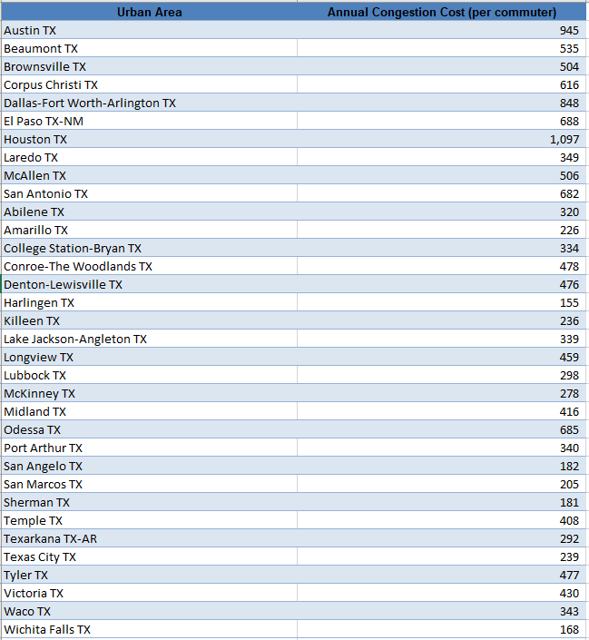
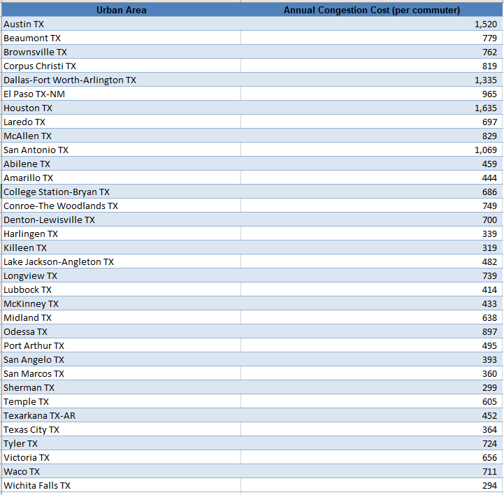
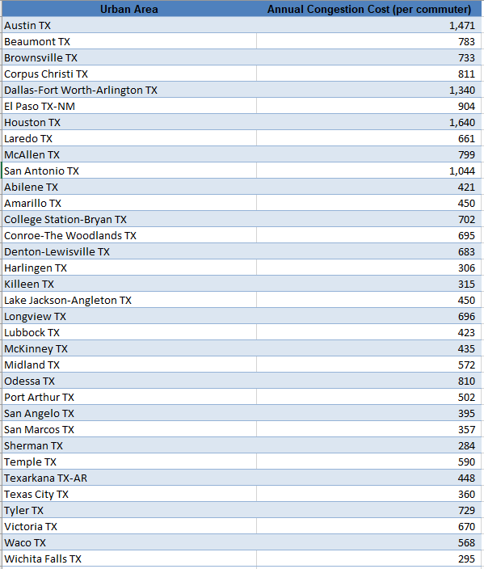

# Cost of congestion

Annual cost of time lost and fuel spent from passenger car delays, per auto commuter

## Transportation

### Goal: Mobility of individuals

Texans can travel to their destinations effectively and efficiently

### Type: Primary indicator

Updated: yes

Data Release Date: 

Comparisons: Metros

----

Date: 2020

Latest Value: $1,097 (value is by metro, we can average all the metros in Texas or take a single one, like Houston)

State Rank: 

Peer Rank: 

----

Previous Date: 2019

Previous Value: $1,635

Previous State Rank: 

Previous Peer Rank: 

----

Metric Trend: up

Target: 922

Baseline: 981

Target Value: 922

Previous Trend: Worsening

### Value

| Year      |  Value      | Rank        | Previous Year | Previous Value | Previous Rank | Trend | 
| ----------- | ----------- | ----------- | ----------- | ----------- | ----------- | -----------|
|   2020      |    $1,097    |             |      2019   |    $1,635     |             |    up     | 

### Data

2020

2019

2018

### Source

[Texas A&M - Transportation Institute, 2021 Urban Mobility Report](https://static.tti.tamu.edu/tti.tamu.edu/documents/mobility-report-2021.pdf)

https://mobility.tamu.edu/umr/congestion-data/

### Notes

Using Houston as a proxy for the state. 

### Indicator Page

[Indicator Link](https://indicators.texas2036.org/indicator/62)

### DataLab Page

[DataLab Link](https://datalab.texas2036.org/rifxnsb/urban-mobility-scorecard-u-s)
