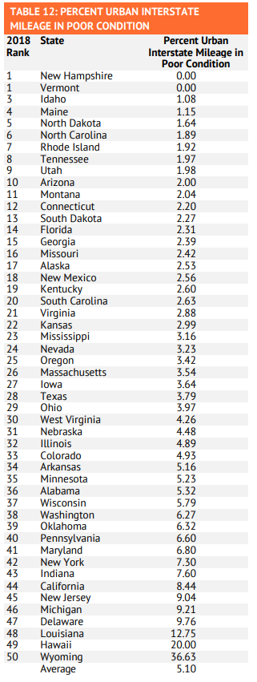

# Miles of road on interstate highways, other freeways and expressways, principal arterial, and minor arterial roads considered good

## Infrastructure

### Primary Indicator

### Goal

Population health

Texans live long, healthy, and productive lives

### Value

| Year      |  Value      | Rank        | Previous Year | Previous Value | Previous Rank | Trend | 
| ----------- | ----------- | ----------- | ----------- | ----------- | ----------- | -----------|
|   2017       | 3.79      |  28        |      2016   |   5.44      |      33   |    up       | 

### Data

### Source

https://reason.org/wp-content/uploads/25th-annual-highway-report.pdf

https://reason.org/policy-study/25th-annual-highway-report/executive-summary/

[Federal Highway Administration - Highway Statistics Series, 2019](https://www.fhwa.dot.gov/policyinformation/statistics/2019/)

[Federal Highway Administration - Highway Statistics Series, 2018](https://www.fhwa.dot.gov/policyinformation/statistics/2018/hm64.cfm)

https://www.fhwa.dot.gov/policy/23cpr/

https://reason.org/policy-study/24th-annual-highway-report/

24th annual state highway report
https://reason.org/wp-content/uploads/24th-annual-highway-report-2019.pdf

https://reason.org/wp-content/uploads/24th-annual-highway-report-2019-state-by-state-summaries.pdf

https://www.fhwa.dot.gov/policy/publications.cfm

https://reason.org/policy-study/24th-annual-highway-report/texas/

### Notes

### Indicator Page

### DataLab Page

