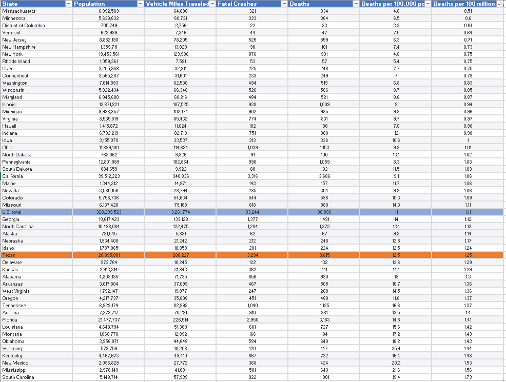

# Traffic fatality rate
Number of fatalities on roads involving at least one motor vehicle per 100 million vehicle miles traveled
## Transportation
### Goal: Safety
Texas maintains a safe transportaiton infrastructure
### Type: Primary indicator
Updated: yes
Data Release Date: 

Comparisons: States

### Value

| Year      |  Value      | Rank        | Previous Year | Previous Value | Previous Rank | Trend | 
| ----------- | ----------- | ----------- | ----------- | ----------- | ----------- | -----------|
|   2019      |  1.25      |    33       |      2017   |   1.29      |          |    flat       | 

### Data

### Source

[IIHS](https://www.iihs.org/topics/fatality-statistics/detail/state-by-state)

<!-- [NSC - Injury Facts](https://injuryfacts.nsc.org/motor-vehicle/overview/preliminary-estimates/data-details/) -->

https://www.fhwa.dot.gov/policyinformation/statistics/2019/pdf/fi30.pdf

https://www.google.com/publicdata/explore?ds=gb66jodhlsaab_

### Notes

2020 -> 3891
2019-> 3586

### Indicator Page

N/A

### DataLab Page

N/A