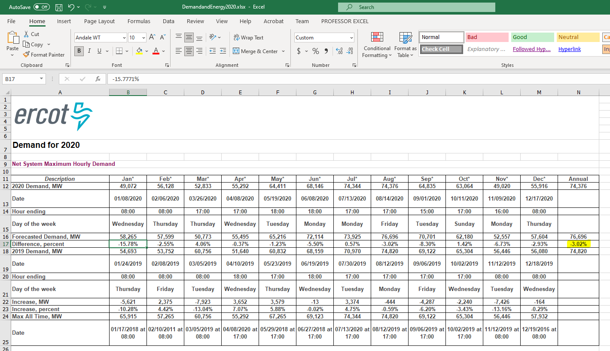
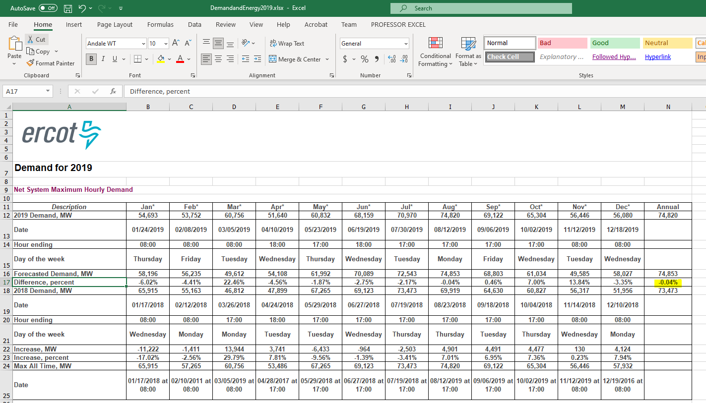
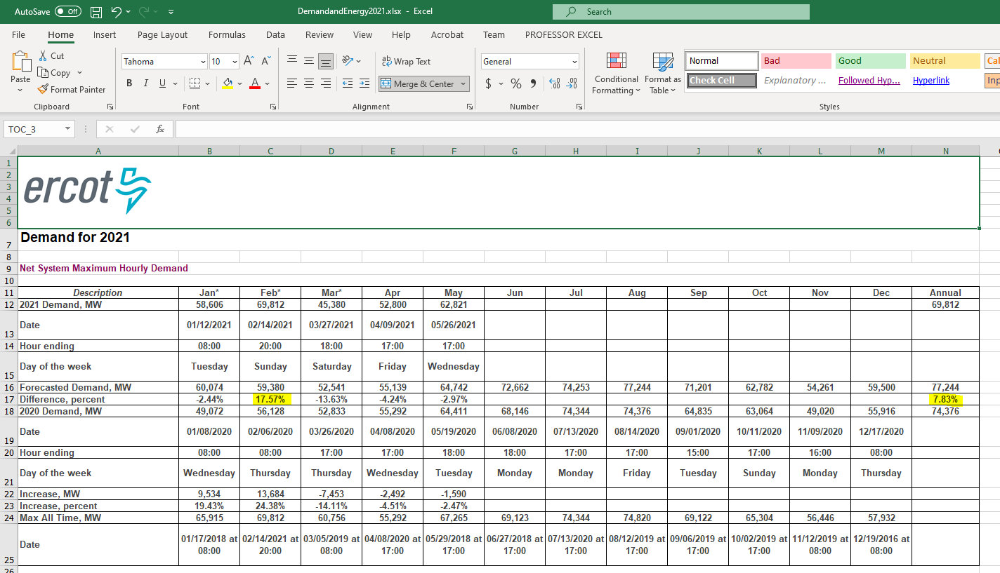

# Electricity sufficiency

Percent difference between the forecasted total generation available and the forecasted peak demand in the following year

## Energy

### Goal: Energy distribution

Texas maintains a sufficient, reliable, and cost-competitive energy infrastructure

### Type: Primary indicator

Updated: yes

Data Release Date: 

Comparisons: Texas

----

Date: 2020

Latest Value: -3.02% (need to make sure this was calculated correctly from source materials)

State Rank: N/A

Peer Rank: 

----

Previous Date: 2019

Previous Value: -.04%

Previous State Rank: 

Previous Peer Rank: 

----

Metric Trend: down

Target: 

Baseline: 

Target Value: 

Previous Trend: 

### Value

| Year      |  Value      | Rank        | Previous Year | Previous Value | Previous Rank | Trend | 
| ----------- | ----------- | ----------- | ----------- | ----------- | ----------- | -----------|
|   2020      |    -3.02%   |    N/A      |      2019   |   -.04%     |             |   down    | 

### Data

2020:

2019:

2021 (for reference, note February)

### Source

[ERCOT](http://www.ercot.com/gridinfo)

### Notes

### Indicator Page

N/A

### DataLab Page

[DataLab Link](https://datalab.texas2036.org/mwdfnte/report-on-the-capacity-demand-and-reserves-cdr-in-the-ercot-region-2020-2024-texas?accesskey=cfgwomb)

