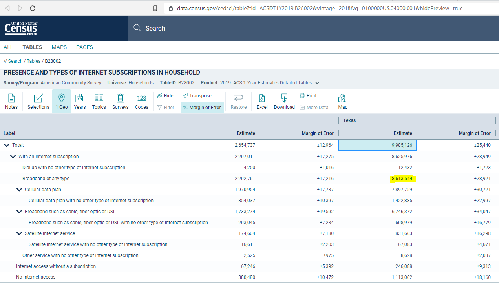

# Broadband subscription

Percent of households with subscription to fixed broadband service of any speed

## Digital

### Goal: Digital connectivity

Texans can digitally participate in economic opportunities and essential services

### Type: Primary indicator

Updated: yes

Data Release Date: December 2020

Comparisons: States

----

Date: 2019

Latest Value: 0.862637487

State Rank: 23

Peer Rank: 6

----

Previous Date:  2018

Previous Value: 0.845139408

Previous State Rank:   6

Previous Peer Rank: 8

----
Metric Trend: up

Target: Top 6

Baseline: 66%

Target Value: 71%

Previous Trend: Improving

### Value

| Year      |  Value      | Rank        | Previous Year | Previous Value | Previous Rank | Trend | 
| ----------- | ----------- | ----------- | ----------- | ----------- | ----------- | -----------|
|   2019       | 86.26%     |     22      |      2018   |   84.51%    |      25     |    up      | 

### Data

### Source

[Census](https://data.census.gov/cedsci/table?tid=ACSDT1Y2019.B28002&vintage=2018&g=0100000US.04000.001&hidePreview=true)

### Notes

### Indicator Page

[Indicator Link](https://indicators.texas2036.org/indicator/69)

### DataLab Page

[DataLab Link](https://datalab.texas2036.org/cecenfe/american-community-survey-5-year-estimates-social-characteristics?accesskey=ciaqduf)
