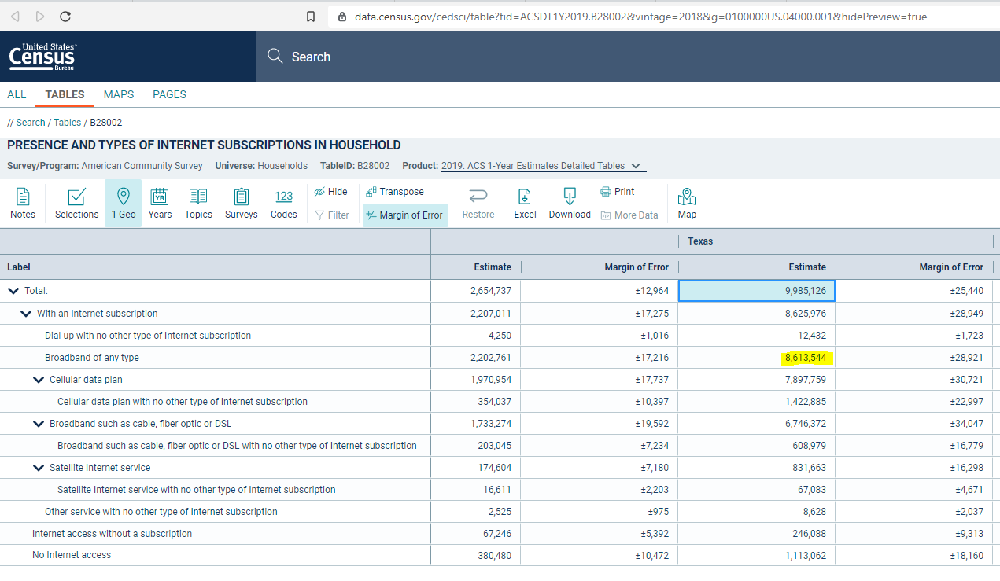

# Broadband subscription
Percent of households with subscription to fixed broadband service of any speed
## Digital
### Goal: Digital connectivity
Texans can digitally participate in economic opportunities and essential services
### Type: Primary indicator
Updated: yes
Data Release Date: 

Comparisons: States

Date: 2019

Latest Value: 86.26% 

State Rank: 

Peer Rank: 

Previous Date: 2018

Previous Value: 84.51%

Previous State Rank: 

Metric Trend: up

Target: Top 6

Baseline: 66%

Previous Target Value: 71%

Previous Trend: Improving

Previous Peer Rank: 12

Previous State Rank (og): 37

### Value

| Year      |  Value      | Rank        | Previous Year | Previous Value | Previous Rank | Trend | 
| ----------- | ----------- | ----------- | ----------- | ----------- | ----------- | -----------|
|   2019       | 86.26%     |             |      2018   |   84.51%    |             |    up      | 

### Data

### Source

[Census](https://data.census.gov/cedsci/table?tid=ACSDT1Y2019.B28002&vintage=2018&g=0100000US.04000.001&hidePreview=true)

### Notes

### Indicator Page

[Indicator Link](https://indicators.texas2036.org/indicator/69)

### DataLab Page

[DataLab Link](https://datalab.texas2036.org/cecenfe/american-community-survey-5-year-estimates-social-characteristics?accesskey=ciaqduf)