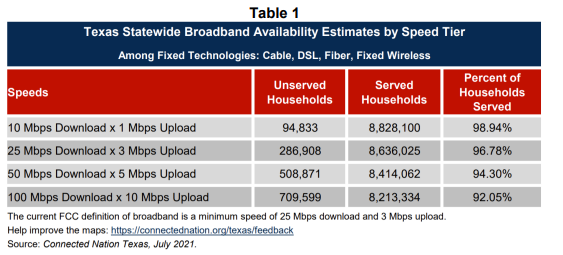
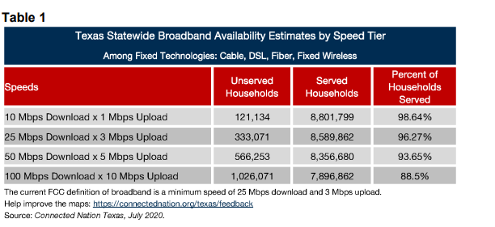

# Broadband coverage (Connected Nation)

Percent of population with access to fixed broadband at an acceptable speed of 25 mbps or higher will shift to 1Gbps download speeds in future

## Digital

### Goal: Digital connectivity

Texans can digitally participate in economic opportunities and essential services

### Type: Primary indicator

Updated: yes

Data Release Date: 

Comparisons: Texas

----

Date: 2020

Latest Value: 96.78%

State Rank: N/A

Peer Rank: N/A

----

Previous Date:  2019

Previous Value: 96.27%

Previous State Rank: N/A

Previous Peer Rank: N/A

----

Metric Trend: flat

Target: 

Baseline: 

Target Value: 

Previous Trend: 

<!--### Value

| Year      |  Value      | Rank        | Previous Year | Previous Value | Previous Rank | Trend | 
| ----------- | ----------- | ----------- | ----------- | ----------- | ----------- | -----------|
|   2019       |  94.1%        |  13         |      2018   |  92.7%     |          |    up       | 

-->
### Data

2021:

2020:

### Source

[Connected Nation](https://connectednation.org/texas/wp-content/uploads/sites/19/2021/07/TX_Broadband_Availability_SpeedTier_2021_07_31.pdf)

[Connected Nation - 2020](https://gov.texas.gov/uploads/files/press/2020_Texas_Report_-_Governors_Broadband_Development_Council.pdf)

### Notes

### Indicator Page

[Indicator Link](https://indicators.texas2036.org/indicator/109)

### DataLab Page
[DataLab Link](https://datalab.texas2036.org/fmlqwqb/americans-with-access-to-fixed-25-mbps-3-mbps-and-mobile-lte-5-mbps-1-mbps-services-by-county?accesskey=yoqdlkb)
