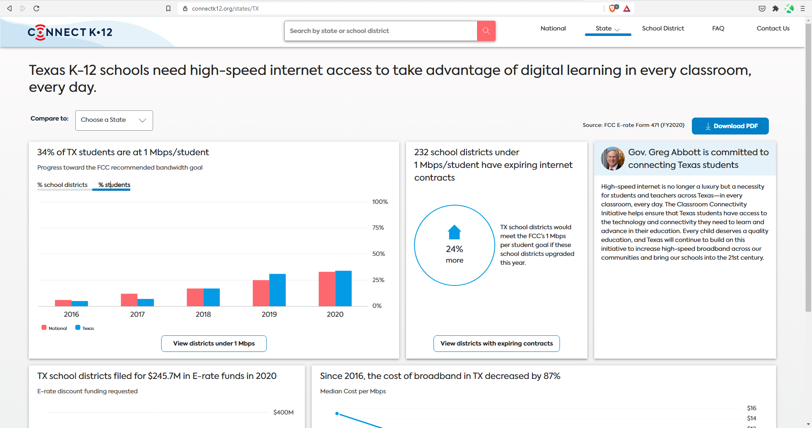
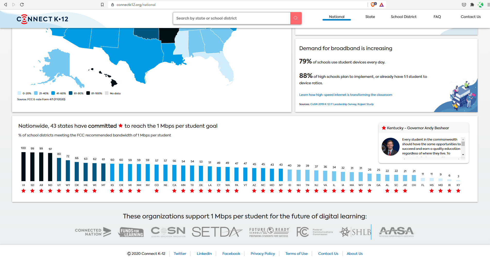

# Access in schools

Percent of students attending public schools with at least 1 Mbps of bandwidth per student

## Digital

### Goal: Digital connectivity

Texans can digitally participate in economic opportunities and essential services

### Type: Secondary indicator

Updated: yes

Data Release Date: 

Comparisons: States

----

Date: 2020

Latest Value: 34% (new source)

State Rank: 20

Peer Rank: 

----

Previous Date: 2019

Previous Value: 31%

Previous State Rank: N/A

Previous Peer Rank: 

----
Metric Trend: up

Target: 

Baseline: 

Target Value: 

Previous Trend: 

### Value

| Year      |  Value      | Rank        | Previous Year | Previous Value | Previous Rank | Trend | 
| ----------- | ----------- | ----------- | ----------- | ----------- | ----------- | -----------|
|   2020      |      34%    |     20     |      2019   |     31%      |    N/A      |    up      | 

### Data

### Source

[ConnectK12.org](https://connectk12.org/states/TX)

https://stateofthestates.educationsuperhighway.org/?postalCd=TX#state

### Notes

### Indicator Page

N/A

### DataLab Page

N/A
