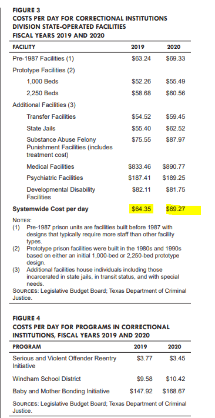

# Prison spending

Average cost per inmate

## Justice & Safety

### Goal: Justice system

Texans are served effectively, efficiently, and impartially by the justice system

### Type: Secondary indicator

Updated: yes

Data Release Date: 

Comparisons: Texas

----

Date: 2020

Latest Value: $69.27 

State Rank: N/A

Peer Rank: 

----

Previous Date: 2019

Previous Value: $64.35

Previous State Rank: N/A

Previous Peer Rank: 

----
Metric Trend: down

Target: 

Baseline: 

Target Value: 

Previous Trend: 

<!--### Value

| Year |  Value      | Rank     | Previous Year   | Previous Value | Previous Rank | Trend | 
| ----------- | ----------- | ----------- | ----------- | ----------- | ----------- | -----------|
|   2020      |     $69.27  | N/A         |    2019     |     $64.35   | N/A        | down       | 

-->
### Data

### Source

[Legislative Budget Board - Criminal and Juvenile Justice
Uniform Cost Report (2019 & 2020)](https://www.lbb.state.tx.us/Documents/Publications/Policy_Report/6292_CJDA_Uniform_Cost.pdf)

[Legislative Budget Board - Criminal and Juvenile Justice
Uniform Cost Report (2017 & 2018)](https://www.lbb.state.tx.us/Documents/Publications/Policy_Report/4911_Criminal_Juvenile_Uniform_Cost_Jan_2019.pdf)

<!-- [TDJC - Report](https://www.texascjc.org/system/files/publications/Spend%20Your%20Values%20Cut%20Your%20Losses%20Portfolio.pdf) -->

### Notes

Numbers are for state operated facilities directly from the Texas Legislative Budget Board Uniform Cost Report.

### Indicator Page

N/A

### DataLab Page

N/A
