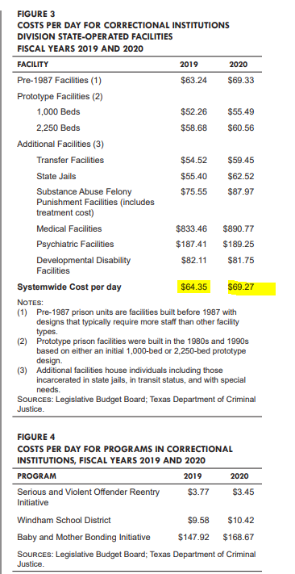

# Prison spending

Average cost per inmate

## Justice & Safety

### Goal: Justice system

Texans are served effectively, efficiently, and impartially by the justice system

### Type: Secondary indicator

Updated: yes

Data Release Date: 

Comparisons: Texas

### Value

| Year |  Value      | Rank     | Previous Year   | Previous Value | Previous Rank | Trend | 
| ----------- | ----------- | ----------- | ----------- | ----------- | ----------- | -----------|
|   2020      |     $69.27  | N/A         |    2019     |     $64.35   | N/A        | down       | 

### Data

### Source

[TDJC - Report](https://www.texascjc.org/system/files/publications/Spend%20Your%20Values%20Cut%20Your%20Losses%20Portfolio.pdf)

[Legislative Budget Board - Criminal and Juvenile Justice
Uniform Cost Report (2019 & 2020)](https://www.lbb.state.tx.us/Documents/Publications/Policy_Report/6292_CJDA_Uniform_Cost.pdf)

[Legislative Budget Board - Criminal and Juvenile Justice
Uniform Cost Report (2017 & 2018)](https://www.lbb.state.tx.us/Documents/Publications/Policy_Report/4911_Criminal_Juvenile_Uniform_Cost_Jan_2019.pdf)

### Notes

The yearly incarceration cost per
person in Texas prisons is $22,751.

Cost calculations were determined as follows: Average monthly costs for prison incarceration were reported by the LBB Uniform Cost Report. https://www.lbb.state.
tx.us/Documents/Publications/Policy_Report/4911_Criminal_Juvenile_Uniform_Cost_Jan_2019.pdf. Monthly costs per person at RRCs were reported by TDCJ through
a data request received in June 2020. Average monthly cost of $500 for residency at Oxford House was reported in a 2015 Texas Oxford House Survey,
https://oxfordhouse.org/userfiles/file/doc/eval_tx2015.pdf.

With active probation supervision totaling $4.39 per person per day and prison totaling $62.34 per
day,30 the above-mentioned 22,000 people revoked and sent to prison are collectively costing taxpayers as much
as $1.27 million per day that could be invested in true community wellness. On top of that, low probation
success rates do not contribute to public safety

Incarcerating a person for life requires decades of public
expenditures. A Tulane University and UC Berkeley study found
California spent between $66 and $83 million between 1990 and
the mid-2000s to incarcerate youth sentenced to LWOP.113 In Texas,
it costs approximately $2.5 million to incarcerate a youth for
life — an enormous expense considering that most young
people are likely rehabilitated long before their 40-year parole
eligibility date. Comparatively, it costs taxpayers approximately
$625,720 to incarcerate a person for 20 years.114 Early release for
those demonstrating sufficient rehabilitation and maturity could
save Texas taxpayers approximately $1,874,280 per person.

Additionally, a child incarcerated at age 16 who is paroled after 20
years could contribute approximately $164,010 in tax revenue by
working until age 66.

#1:Texas spends the most in the nation
on prisons and jails; over the past three
decades, it has grown 5x faster than the
state’s rate of spending on elementary and
secondary education.

Texas already spends a smaller percentage on health and welfare than most other states,8
yet its state investment in police increased 54 percent from 2012 to 2018, during which time
investments in education, public welfare, health, and parks and recreation each increased by 26
percent or less. Funding for corrections increased 12 percent and brought the state’s corrections
budget to a staggering $3.4 billion per year.9
Yet, an over-reliance on corrections does not make Texans safer. Studies show that mass
incarceration has marginal to zero impact on crime.10 What makes communities safer is
education and employment, safe and stable housing, quality health care, restorative
justice, and other community-based supports and services.
We must stop wasting hard-earned taxpayer dollars and human potential on failed justice policies.
Texans deserve better than a “penny wise, pound foolish” approach to public safety. 

State Residential Facility cost per youth per day: $479.56

### Indicator Page

N/A

### DataLab Page

N/A