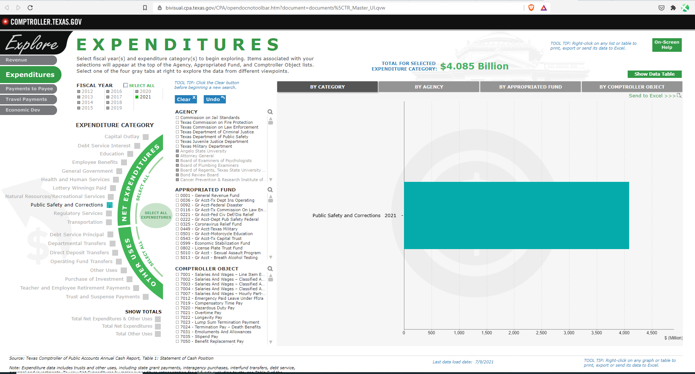

# Share of budget

Corrections expenditures as percent of total state general funds expenditures

## Justice & Safety

### Goal: Justice system

Texans are served effectively, efficiently, and impartially by the justice system

### Type: Secondary indicator

Updated: yes

Data Release Date: 

Comparisons: Texas

----

Date: 2021

Latest Value: 1.46% 

State Rank: N/A

Peer Rank: 

----

Previous Date: 2019

Previous Value: 1.95%

Previous State Rank: N/A

Previous Peer Rank: 

----
Metric Trend: flat

Target: 

Baseline: 

Target Value: 

Previous Trend: 

### Value

| Year |  Value      | Rank     | Previous Year   | Previous Value | Previous Rank | Trend | 
| ----------- | ----------- | ----------- | ----------- | ----------- | ----------- | -----------|
|    2021     | 1.46%       |     N/A     |    2019     |  1.95%      |    N/A      |     flat   |

### Data

2019:
$5.193 Billion
$265.6 Billion

 $5,192,954,308.00 
 $265,645,296,845.00 

2020:
$4.931 Billion
$334.4 Billion

2021:
$4.085 Billion
$279.2 Billion

### Source

[TX Comptroller](https://bivisual.cpa.texas.gov/CPA/opendocnotoolbar.htm?document=documents%5CTR_Master_UI.qvw)

### Notes

The link above takes you to an interactive visual to look at revenue and expenditures for Texas. 

Select Expenditures at the top left.

"Select All Expenditures" to get sum of total expenditures. 

"Public Safety and Corrections" to get the expenditure for corrections.

### Indicator Page

N/A

### DataLab Page

N/A
