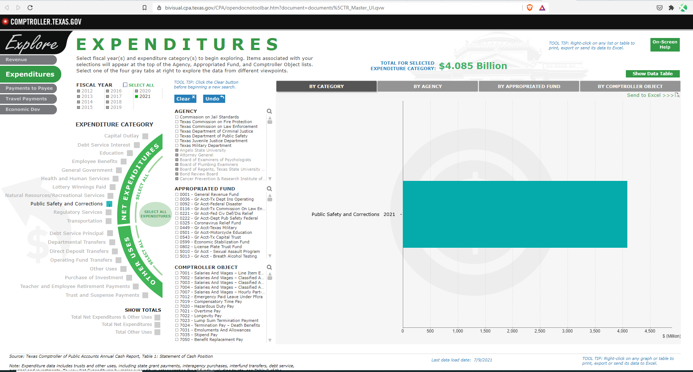

# Share of budget

Corrections expenditures as percent of total state general funds expenditures

## Justice & Safety

### Goal: Justice system

Texans are served effectively, efficiently, and impartially by the justice system

### Type: Secondary indicator

Updated: yes

Data Release Date: 

### Value

| Year |  Value      | Rank     | Previous Year   | Previous Value | Previous Rank | Trend | 
| ----------- | ----------- | ----------- | ----------- | ----------- | ----------- | -----------|
|             |             |             |             |             |             |             |

### Data

2020:
$4.931 Billion
172 billion

2021:
$4.085 Billion
153 billion

### Source

[TX Comptroller](https://bivisual.cpa.texas.gov/CPA/opendocnotoolbar.htm?document=documents%5CTR_Master_UI.qvw)

### Notes

### Indicator Page

N/A

### DataLab Page

N/A