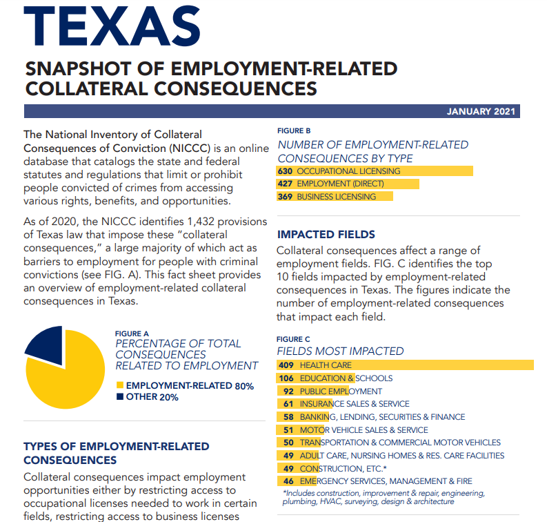

# Count of legal restrictions that limit people with criminal records from accessing employment, occupational licensing, housing, voting, and education

## Justice & Safety

### Secondary Indicator

### **Goal**

Texas protects the vulnerable from traumatic experiences

Protection for the vulnerable

### Value

| Year |  Value      | Rank     | Previous Year   | Previous Value | Previous Rank | Trend | 
| ----------- | ----------- | ----------- | ----------- | ----------- | ----------- | -----------|
|    2020    |     1,432      | N/A         |             |          | N/A         |   📈       | 

### Data

### Source

[TX Summary](https://csgjusticecenter.org/publications/after-the-sentence-more-consequences/state-reports/state/?usState=texas)

[Council of State Governments - Justice Center](https://csgjusticecenter.org/publications/after-the-sentence-more-consequences/state-reports/)

### Notes

### Indicator Page

N/A

### DataLab Page

N/A
