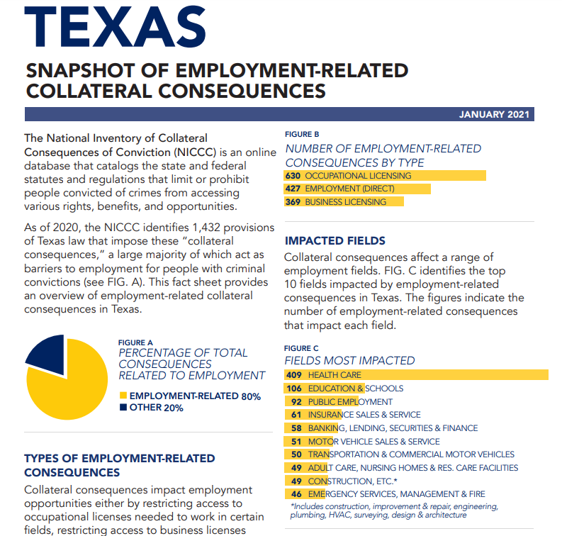

# Collateral consequences

Count of legal restrictions that limit people with criminal records from accessing employment, occupational licensing, housing, voting, and education

## Justice & Safety

### Goal: Justice system

Texans are served effectively, efficiently, and impartially by the justice system

### Type: Secondary indicator

Updated: yes

Data Release Date: 

Comparisons: States

----

Date: 2020

Latest Value: 1,432 

State Rank: N/A

Peer Rank: 

----

Previous Date: N/A (this is a dynamic list, not an annual report so past is not available)

Previous Value: N/A

Previous State Rank: N/A

Previous Peer Rank: 

----
Metric Trend: N/A

Target: 

Baseline: 

Target Value: 

Previous Trend: 

### Value

| Year |  Value      | Rank     | Previous Year   | Previous Value | Previous Rank | Trend | 
| ----------- | ----------- | ----------- | ----------- | ----------- | ----------- | -----------|
|    2020    |     1,432      | N/A         |     N/A      |    N/A     | N/A         |   N/A    | 

### Data

### Source

[NICCC](https://niccc.nationalreentryresourcecenter.org/)

[TX Summary](https://csgjusticecenter.org/publications/after-the-sentence-more-consequences/state-reports/state/?usState=texas)

[Council of State Governments - Justice Center](https://csgjusticecenter.org/publications/after-the-sentence-more-consequences/state-reports/)

### Notes

The source at the top above is a database of restrictions that can't be queried by year so we can't get past values.

### Indicator Page

N/A

### DataLab Page

N/A
