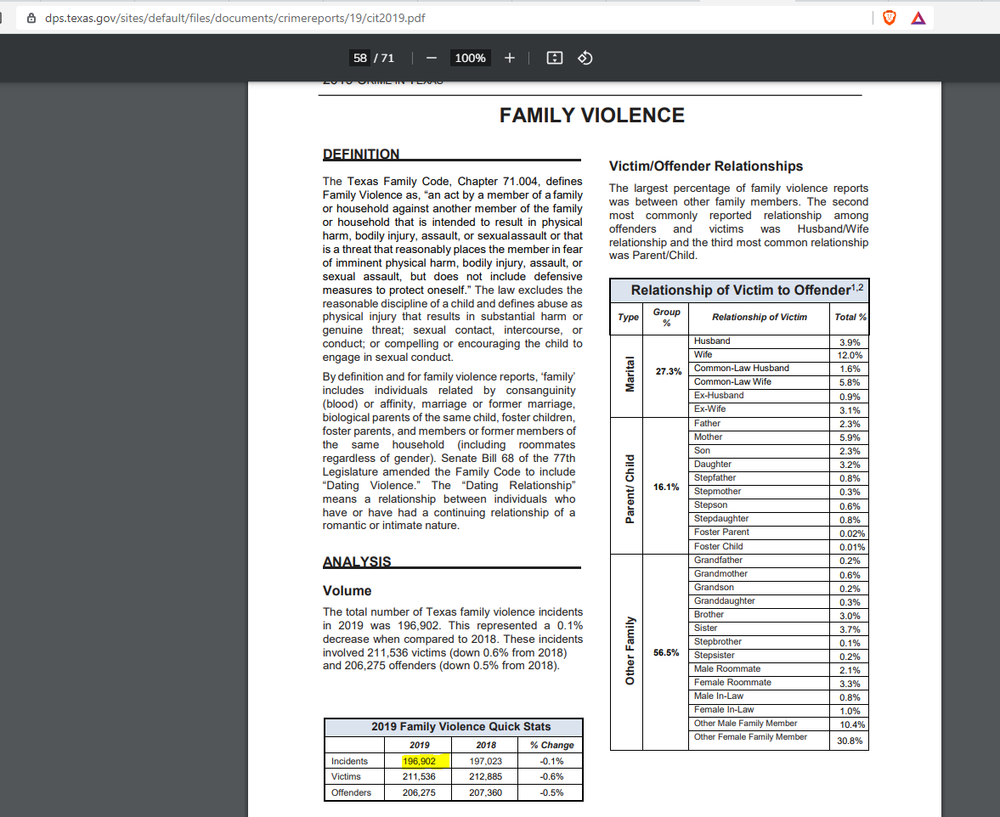

# Domestic violence

Incidents of domestic violence

## Justice & Safety

### Goal: Protection for the vulnerable

Texas protects the vulnerable from traumatic experiences

### Type: Secondary indicator

Updated: yes

Data Release Date: 

Comparisons: Texas

----

Date: 2019

Latest Value: 196,902 

State Rank: N/A

Peer Rank: 

----

Previous Date: 2018

Previous Value: 197,023

Previous State Rank: N/A

Previous Peer Rank: 

----
Metric Trend: up

Target: 

Baseline: 

Target Value: 

Previous Trend: 

### Value

| Year |  Value      | Rank     | Previous Year   | Previous Value | Previous Rank | Trend | 
| ----------- | ----------- | ----------- | ----------- | ----------- | ----------- | -----------|
|   2019      |    196,902  |     N/A     |     2018    |   197,023   |       N/A   |    up      |

### Data

### Source

[2019 Crime in Texas](https://www.dps.texas.gov/sites/default/files/documents/crimereports/19/cit2019.pdf)

County Data Reporting Improvement Plans:
https://www.dps.texas.gov/section/crime-records-service/county-data-reporting-improvement-plans

### Notes

2020 Crime Report has not been released yet. 

[TX - DPS - Crime Reports](https://www.dps.texas.gov/section/crime-records-service/crime-texas)

### Indicator Page

N/A

### DataLab Page

[DataLab Link](https://datalab.texas2036.org/mlcgkac/texas-family-violence-offenses?accesskey=yduocag)
