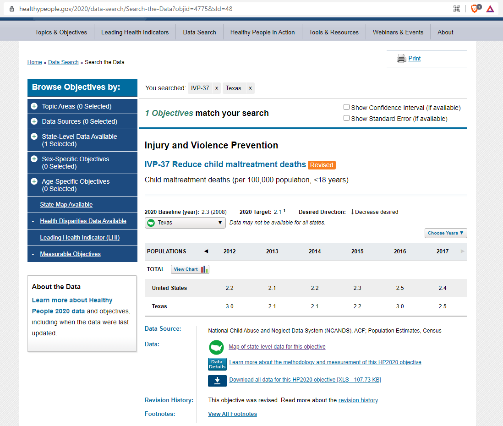

# Child maltreatment

Injury or death of population less than age 18 due to maltreatment per 100,000 population

## Justice & Safety

### Goal: Protection for the vulnerable

Texas protects the vulnerable from traumatic experiences

### Type: Secondary indicator

Updated: no

Data Release Date: 

Comparisons: States

----

Date: 2017

Latest Value: 2.5 

State Rank: N/A

Peer Rank: 

----

Previous Date: 2015

Previous Value: 3.0

Previous State Rank: N/A

Previous Peer Rank: 

----
Metric Trend: down

Target: 

Baseline: 

Target Value: 

Previous Trend: 

### Value

| Year |  Value      | Rank     | Previous Year   | Previous Value | Previous Rank | Trend | 
| ----------- | ----------- | ----------- | ----------- | ----------- | ----------- | -----------|
|    2017     |  2.5     | N/A         |   2015     |   3.0       | N/A         |   down       | 

### Data

### Source

[HealthyPeople.gov](https://www.healthypeople.gov/2020/data/map/4775?year=2017)

[HealthyPeople.gov - data search](https://www.healthypeople.gov/2020/data-search/Search-the-Data?objid=4775&sld=48)

### Notes

Source has not been updated since 2017.

### Indicator Page

N/A

### DataLab Page

N/A

