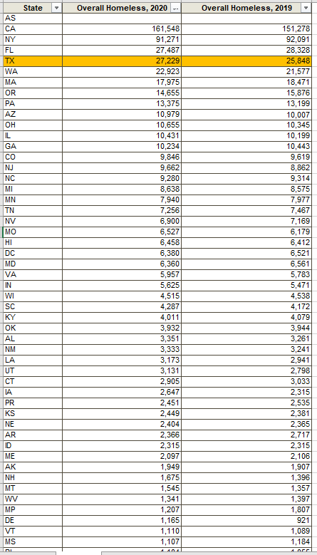

# Homeless population

Number of people homeless per 10,000 population

## Justice & Safety

### Goal: Safety net

Texans have access to resources to meet basic needs when they are in crisis

### Type: Secondary indicator

Updated: yes

Data Release Date: 

Comparisons: States

----

Date: 2020

Latest Value: 9.158666386

State Rank: 18

Peer Rank: 5

----

Previous Date:  2019

Previous Value: 8.914369596

Previous State Rank:   5

Previous Peer Rank: 5

----
Metric Trend: flat

Target: 

Baseline: 

Target Value: 

Previous Trend: 

<!--### Value

| Year |  Value      | Rank     | Previous Year   | Previous Value | Previous Rank | Trend | 
| ----------- | ----------- | ----------- | ----------- | ----------- | ----------- | -----------|
|    2020     |      27,229 | 4         |     2019    |   25,848    | 4        | flat       | 

-->
### Data

### Source

[HUD - Point in Time Homeless Estimates](https://www.huduser.gov/portal/datasets/ahar/2020-ahar-part-1-pit-estimates-of-homelessness-in-the-us.html)

### Notes

### Indicator Page

N/A

### DataLab Page

N/A
