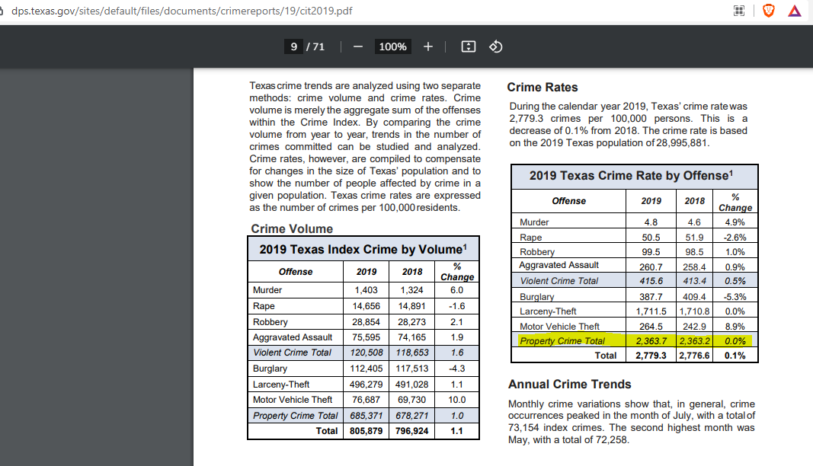

# Number of property crimes reported per 100,000 population

## Justice & Safety

### Primary Indicator

### **Goal**

Public safety

Texans are protected from threats to their well-being and property

### Value

| Year |  Value      | Rank     | Previous Year   | Previous Value | Previous Rank | Trend | 
| ----------- | ----------- | ----------- | ----------- | ----------- | ----------- | -----------|
|    2019     |   2,363.7   |             |     2018    |    2,363.2  |             |     flat   |

### Data

Total Property Crimes:

2019-685,371 

2018-678,271

### Source

[Texas Crime Report - 2019](https://www.dps.texas.gov/sites/default/files/documents/crimereports/19/cit2019.pdf)

### Notes

### Indicator Page

[Indicator Link](https://indicators.texas2036.org/indicator/87)

### DataLab Page

[DataLab Link](https://datalab.texas2036.org/dbkqjpe/texas-crime-rate-by-offense-crime-index-by-volume?accesskey=bqthjxg)