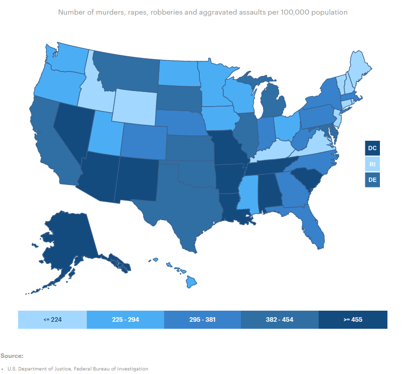
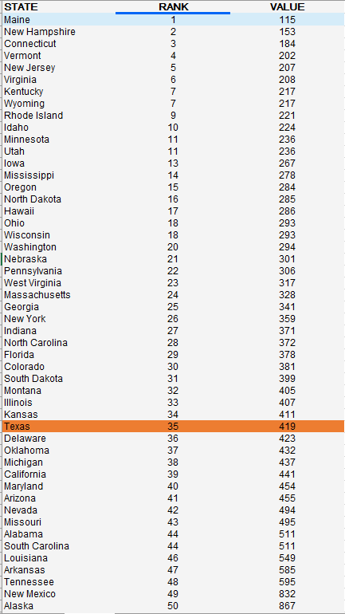
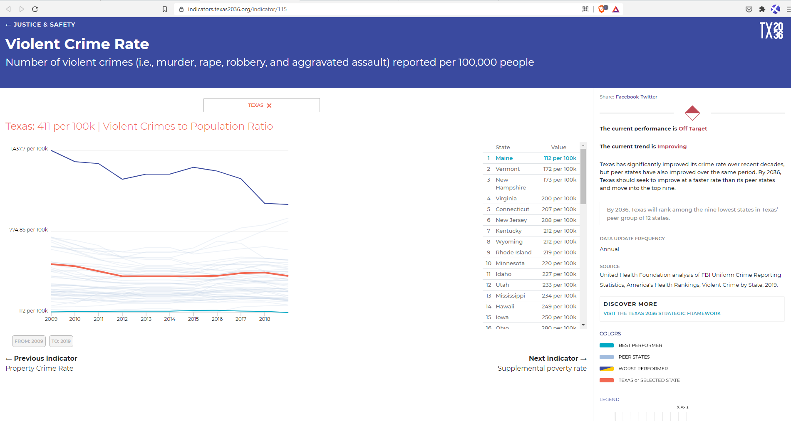
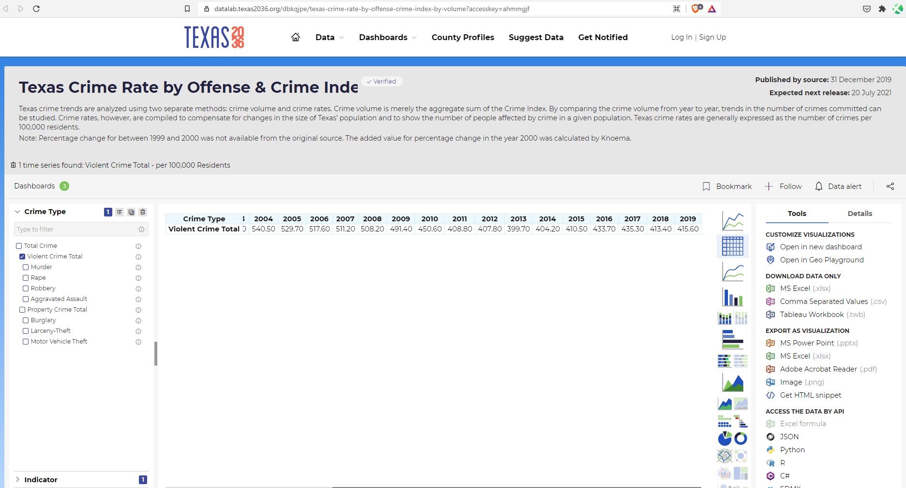

# Number of violent crimes reported per 100,000 population

## Justice & Safety

### Primary Indicator

### **Goal**

Public safety

Texans are protected from threats to their well-being and property

### Value

|Year         |  Value      | Rank        | Previous Year| Previous Value | Previous Rank  | Trend| 
| ----------- | ----------- | ----------- | ----------- | ----------- | ----------- | -----------|
|      2020   |   419       |   35        |   2019      |    411      |     34      |   down     |

### Data

### Source

[AmericasHealthRankings](https://www.americashealthrankings.org/explore/annual/measure/Crime/state/ALL)

### Notes

### Indicator Page

[Indicator Link](https://indicators.texas2036.org/indicator/115)

### DataLab Page

[DataLab Link](https://datalab.texas2036.org/dbkqjpe/texas-crime-rate-by-offense-crime-index-by-volume?accesskey=ahmmgjf)

