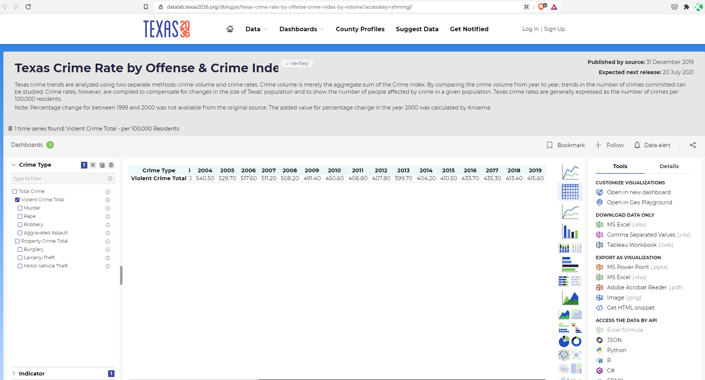

# Violent crime rate

Number of violent crimes reported per 100,000 population

## Justice & Safety

### Goal: Public safety

Texans are protected from threats to their well-being and property

### Type: Primary indicator

Updated: yes

Data Release Date: 

Comparisons: States

----

Date: 2019

Latest Value: 419

State Rank: 35

Peer Rank: 11

----

Previous Date:  2018

Previous Value: 410.9

Previous State Rank:   11

Previous Peer Rank: 11

----

Metric Trend: flat

Target: Top 9

Baseline: 411

Target Value: 397

Previous Trend: Flat

### Value

|Year         |  Value      | Rank        | Previous Year| Previous Value | Previous Rank  | Trend| 
| ----------- | ----------- | ----------- | ----------- | ----------- | ----------- | -----------|
|      2020   |   419       |   35        |   2019      |    411      |     34      |   down     |

### Data

### Source

[FBI - Crime in 2019](https://ucr.fbi.gov/crime-in-the-u.s/2019/crime-in-the-u.s.-2019/topic-pages/tables/table-5)

[FBI - Crime in 2018](https://ucr.fbi.gov/crime-in-the-u.s/2018/crime-in-the-u.s.-2018/topic-pages/tables/table-5)

<!-- 
[AmericasHealthRankings](https://www.americashealthrankings.org/explore/annual/measure/Crime/state/ALL) -->

### Notes

### Indicator Page

[Indicator Link](https://indicators.texas2036.org/indicator/115)

### DataLab Page

[DataLab Link](https://datalab.texas2036.org/dbkqjpe/texas-crime-rate-by-offense-crime-index-by-volume?accesskey=ahmmgjf)

