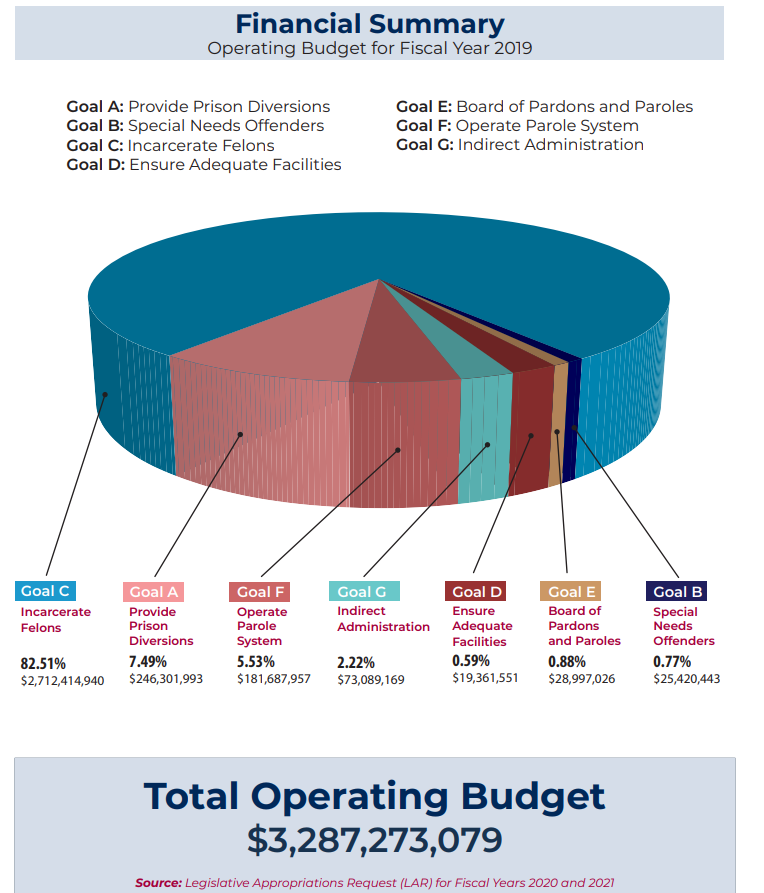
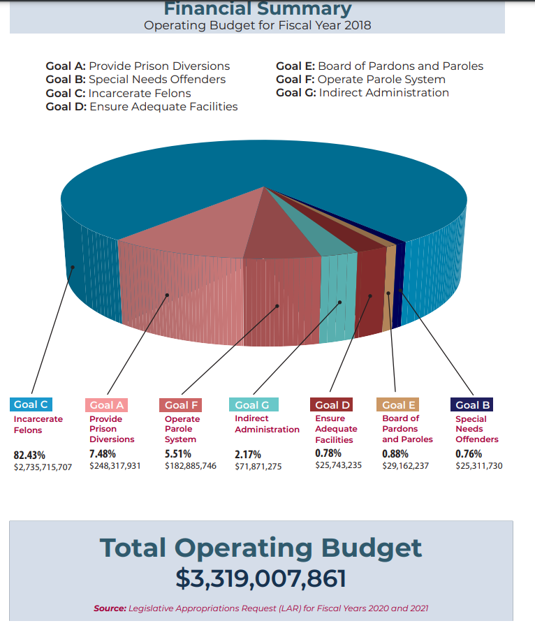

# Prison diversions

Percent of TDCJ budget allocated to prison diversions

## Justice & Safety

### Goal: Justice system

Texans are served effectively, efficiently, and impartially by the justice system

### Type: Secondary indicator

Updated: yes

Data Release Date: 

Comparisons: Texas

### Value

| Year |  Value      | Rank     | Previous Year   | Previous Value | Previous Rank | Trend | 
| ----------- | ----------- | ----------- | ----------- | ----------- | ----------- | -----------|
|   2019      |   7.49%     |     N/A     |    2018      |    7.48%    |      N/A     |    flat    |

### Data

2019:

2018:

### Source

[TDCJ - Annual Report - 2019](https://www.tdcj.texas.gov/documents/Annual_Review_2019.pdf)

[TDCJ - Annual Report - 2018](https://www.tdcj.texas.gov/documents/Annual_Review_2018.pdf)

https://www.tdcj.texas.gov/documents/bfd/FY2020_Operating_Budget.pdf
https://www.tdcj.texas.gov/documents/bfd/Operating_Budget_FY2019_LAR_Summary_FY2020-21.pdf

### Notes

### Indicator Page

N/A

### DataLab Page

[DataLab Link](https://datalab.texas2036.org/TDCJCS2019/prison-statistics-of-texas?accesskey=mrcftkf)