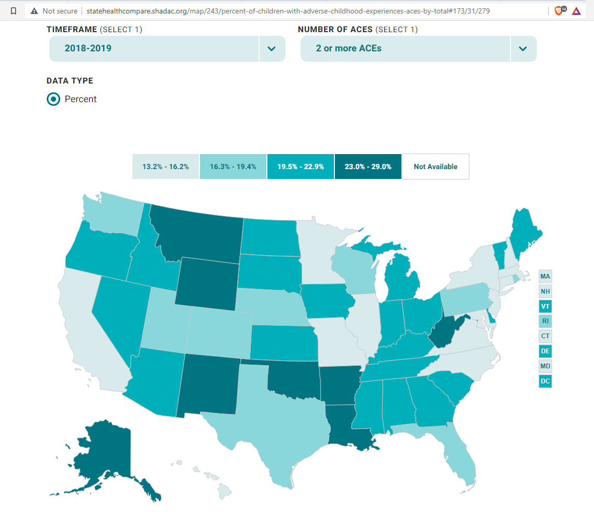
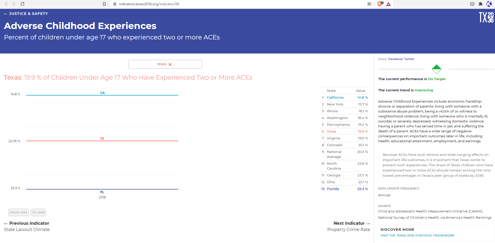
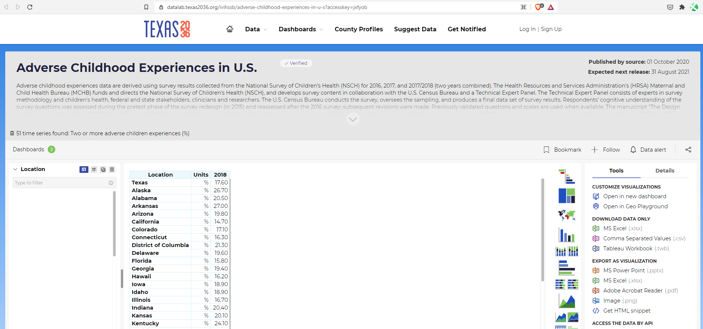

# Percent of children under age 17 who experienced two or more ACEs

## Justice & Safety

### Primary Indicator

### **Goal**

Protection for the vulnerable

Texas protects the vulnerable from traumatic experiences

### Value

| Year |  Value      | Rank     | Previous Year   | Previous Value | Previous Rank | Trend | 
| ----------- | ----------- | ----------- | ----------- | ----------- | ----------- | -----------|
|             |     19.4   | 22         |             |      16.8   |   12      | down      | 

### Data

### Source

[Shadac](http://statehealthcompare.shadac.org/map/243/percent-of-children-with-adverse-childhood-experiences-aces-by-total#173/31/279)

### Notes

### Indicator Page

[Indicator Link](https://indicators.texas2036.org/indicator/88)

### DataLab Page

[DataLab Link](https://datalab.texas2036.org/ivihssb/adverse-childhood-experiences-in-u-s?accesskey=jxfyob)

