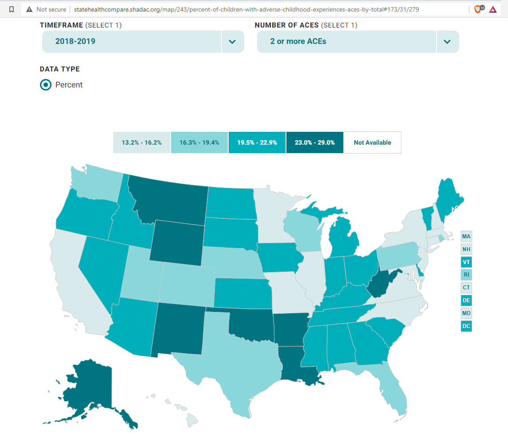
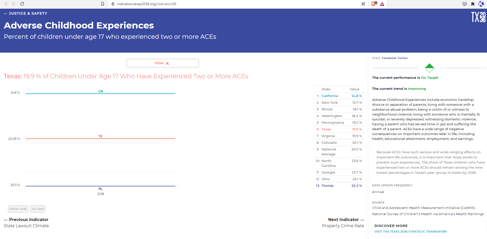
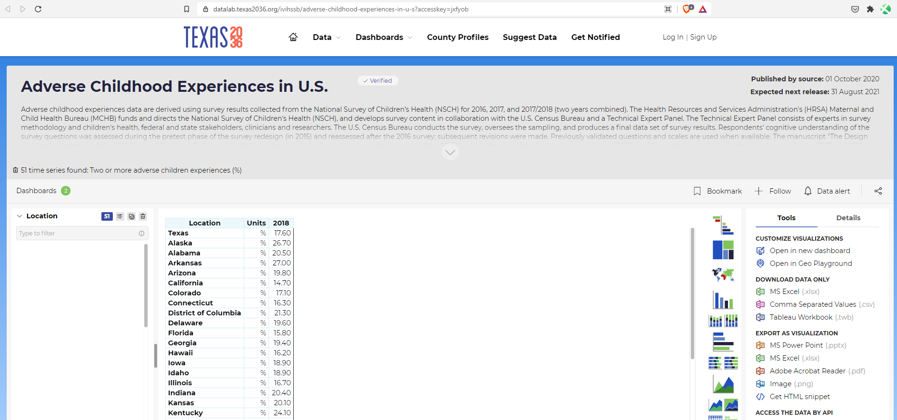

# Adverse Childhood Experiences

Percent of children under age 17 who experienced two or more ACEs

## Justice & Safety

### Goal: Protection for the vulnerable

Texas protects the vulnerable from traumatic experiences

### Type: Primary indicator

Updated: yes

Data Release Date: 

Comparisons: States

----

Date: 2019

Latest Value: 19.4%

State Rank: 21

Peer Rank: 10

----

Previous Date:  2017

Previous Value: 19.9%

Previous State Rank:   8

Previous Peer Rank: 7

----
Metric Trend: down

Target: Top 9

Baseline: 20%

Target Value: 24%

Previous Trend: Flat

### Value

| Year |  Value      | Rank     | Previous Year   | Previous Value | Previous Rank | Trend | 
| ----------- | ----------- | ----------- | ----------- | ----------- | ----------- | -----------|
|    2019     |     19.4   | 22         |    2018     |      16.8   |   12      | down      | 

### Data

### Source

[Shadac](http://statehealthcompare.shadac.org/map/243/percent-of-children-with-adverse-childhood-experiences-aces-by-total#173/31/279)

### Notes

No Notes. Standard source.

### Indicator Page

[Indicator Link](https://indicators.texas2036.org/indicator/88)

### DataLab Page

[DataLab Link](https://datalab.texas2036.org/ivihssb/adverse-childhood-experiences-in-u-s?accesskey=jxfyob)

