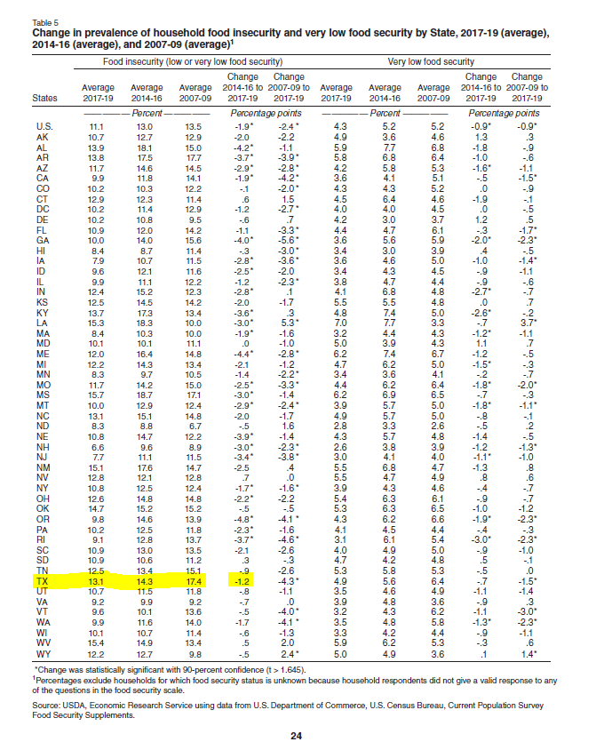
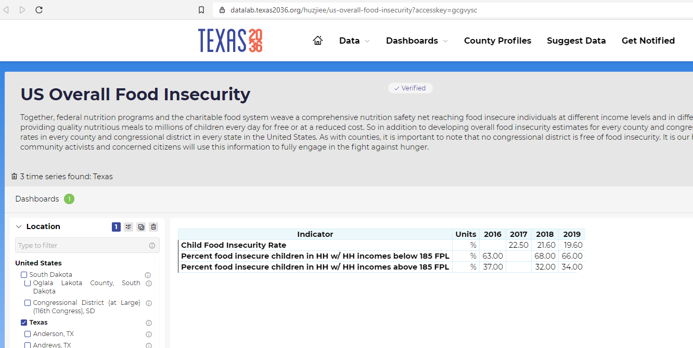

# Food insecurity
Percent of households with limited or uncertain access to food
## Justice & Safety
### Goal: Safety net
Texans have access to resources to meet basic needs when they are in crisis
### Type: Secondary indicator
Updated: yes
Data Release Date: 

Comparisons: States

Date: 2019

Latest Value: 13.1% 

State Rank: 43

Peer Rank: 

Previous Date: 2016

Previous Value: 14.3%

Previous State Rank: 36

Metric Trend: flat

Target: 

Baseline: 

Previous Target Value: 

Previous Trend: 

Previous Peer Rank: 

Previous State Rank (og): 

### Value

| Year |  Value      | Rank     | Previous Year   | Previous Value | Previous Rank | Trend | 
| ----------- | ----------- | ----------- | ----------- | ----------- | ----------- | -----------|
|    2019     |    13.1%    | 43          |    2016   |   14.3%     | 36          | flat       | 

### Data

### Source

[USDA - Household Food Security in the United States in 2019](https://www.ers.usda.gov/webdocs/publications/99282/err-275.pdf)

[Previous Source](https://frac.org/maps/food-security/tables/tab2_foodinsec_chg_2008_2018.html)

### Notes

### Indicator Page

N/A

### DataLab Page

[DataLab Link](https://datalab.texas2036.org/huzjiee/us-overall-food-insecurity?accesskey=gcgvysc)

