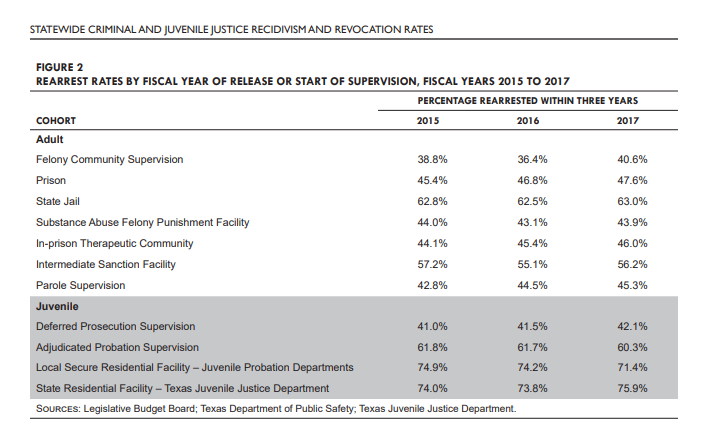

# Recidivism

Percent of individuals released from incarceration who are rearrested within three years

## Justice & Safety

### Goal: Justice system

Texans are served effectively, efficiently, and impartially by the justice system

### Type: Primary indicator

Updated: yes

Data Release Date: January 2021

Comparisons: Texas

----

Date: 2017

Latest Value: 63%

State Rank:

Peer Rank: 

----

Previous Date: 2016

Previous Value: 62.5%

Previous State Rank:

Previous Peer Rank: 

----

Metric Trend: flat

Target: Below national average

Baseline: 63%

Target Value: 68%

Previous Trend: Flat

### Value

| Year |  Value      | Rank     | Previous Year   | Previous Value | Previous Rank | Trend | 
| ----------- | ----------- | ----------- | ----------- | ----------- | ----------- | -----------|
|    2020     |     19.4   | 22         |    2019    |      16.8   |   12      | down      | 

### Data

<!--  -->

### Source

[TX Legislative Budget Board - Statewide Criminal and Juvenile Justice - Recidivism and Revocation Rates](https://www.lbb.state.tx.us/documents/publications/policy_report/6293_cjda_recidivism-revocation.pdf)

https://worldpopulationreview.com/state-rankings/recidivism-rates-by-state

### Notes

Latest number I have is from a Texas report, so we can't get state comparisons. I couldn't find one consecutive year report with all the states. 

Choice of source I think comes down to wanting the comparison or having a reliable update every year for a standard number.

There are a few sources/reports that cover every state, but not every year:

[Here is one from 2018](https://vadoc.virginia.gov/media/1363/vadoc-state-recidivism-comparison-report-2018-12.pdf)

[The sentencing project has one for 2019](https://www.sentencingproject.org/the-facts/#map)

### Indicator Page

[Recidivism - Prison](https://indicators.texas2036.org/indicator/116)

[Recidivism - State Jails](https://indicators.texas2036.org/indicator/144)

### DataLab Page

[DataLab Link](https://datalab.texas2036.org/LBBAI2019/texas-recidivism-rates-re-arrests-and-re-incarceration-for-adults?accesskey=qrjrnp)

