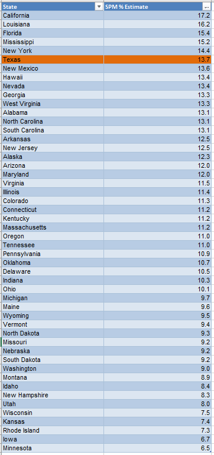
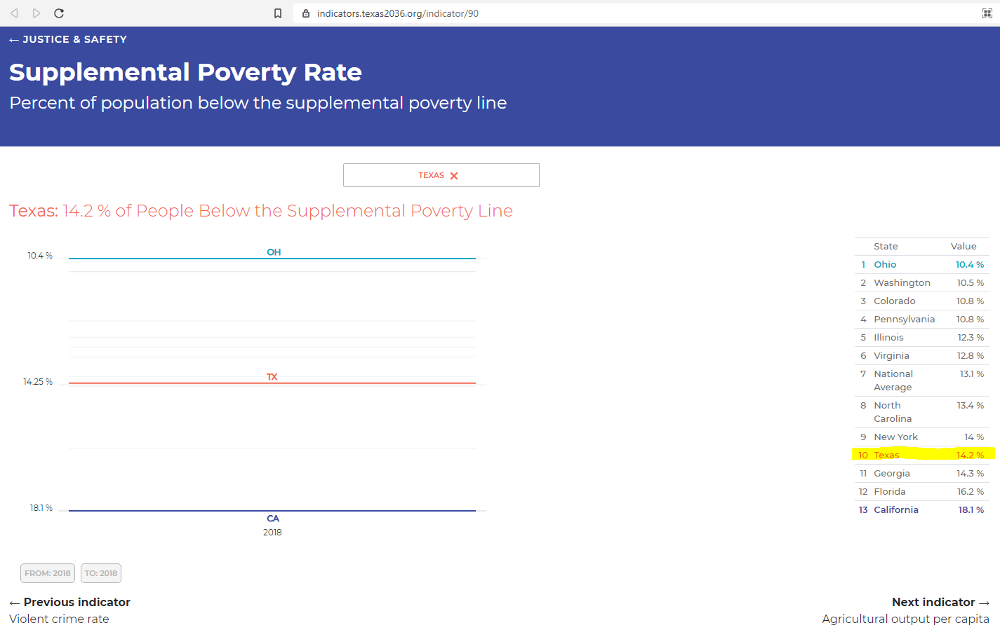

# Supplemental poverty rate

Percent of population below the supplemental poverty line
## Justice & Safety
### Goal: Safety net
Texans have access to resources to meet basic needs when they are in crisis
### Type: Primary indicator
Updated: yes
Data Release Date: 

Comparisons: States

Date: 2019

Latest Value: 13.7 

State Rank: 45

Peer Rank: 

Previous Date: 2018

Previous Value: 14.2

Previous State Rank: 43

Metric Trend: flat

Target: Top 3

Baseline: 14.2%

Previous Target Value: 10.8%

Previous Trend: Worsening

Previous Peer Rank: 9

Previous State Rank (og): 42

### Value

| Year |  Value      | Rank     | Previous Year   | Previous Value | Previous Rank | Trend | 
| ----------- | ----------- | ----------- | ----------- | ----------- | ----------- | -----------|
|    2019     |      13.7   | 45        |    2018     |      14.2    |   43    | flat      | 

### Data

### Source

[Census - The Supplemental Poverty Measure: 2019](./p60-272.pdf)

[2019 Source](https://www.census.gov/library/publications/2020/demo/p60-272.html)

[2018 Source](https://www.census.gov/data/tables/2019/demo/income-poverty/p60-268.html)

[Census - The Supplemental Poverty Measure: 2019](https://www.census.gov/library/publications/2020/demo/p60-272.html)

[Census - The Supplemental Poverty Measure: 2018](https://www.census.gov/library/publications/2019/demo/p60-268.html)

### Notes

### Indicator Page

[Indicator Link](https://indicators.texas2036.org/indicator/90)

### DataLab Page

N/A
