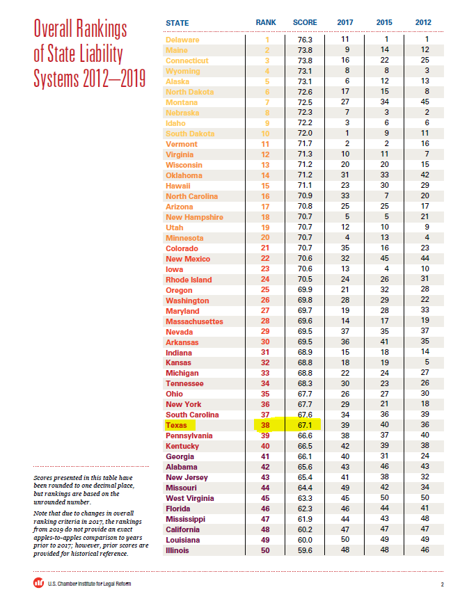

# State Lawsuit Climate

The U.S. Chamber’s Institute for Legal Reform conducts a survey of in-house general counsel

## Justice & Safety

### Goal: Justice system

Texans are served effectively, efficiently, and impartially by the justice system

### Type: Primary indicator

Updated: no

Data Release Date: 

Comparisons: States

----

Date: 2019

Latest Value: 67.1

State Rank: 38

Peer Rank: 6

----

Previous Date: 2017

Previous Value: 64.3

Previous State Rank: 39

Previous Peer Rank: 8

----

Metric Trend: up

Target: Top 3

Baseline: 67.1%

Target Value: 71%

Previous Trend: Improving

### Value

| Year |  Value      | Rank     | Previous Year   | Previous Value | Previous Rank | Trend | 
| ----------- | ----------- | ----------- | ----------- | ----------- | ----------- | -----------|
|             |  67.1 (2019)         | 38        |             |    N/A       | 39         |   flat       | 

### Data

### Source

[2019 LAWSUIT CLIMATE SURVEY: RANKING THE STATES](./2019_Lawsuit_Climate_Survey_-_Ranking_the_States.pdf)

[Institute Web Page](https://instituteforlegalreform.com/research/2019-lawsuit-climate-survey-ranking-the-states/)

[2017 Lawsuit Report](https://instituteforlegalreform.com/research/2017-lawsuit-climate-survey-ranking-the-states/)

### Notes

This one hasn't changed since the SF. 

I haven't been able to find any info on if they're doing a 2021 report.

### Indicator Page

[Indicator Page](https://indicators.texas2036.org/indicator/143)

### DataLab Page

N/A
