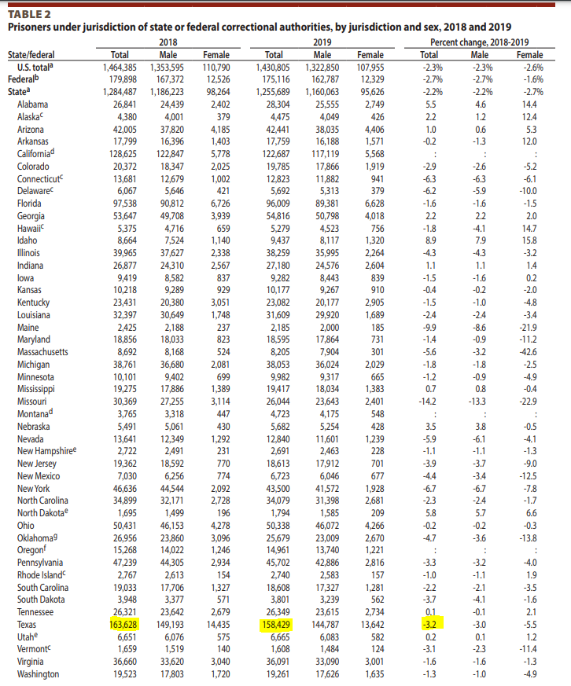
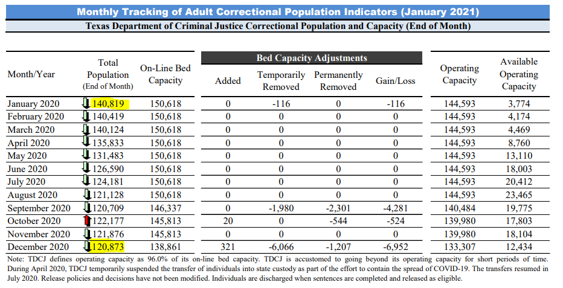
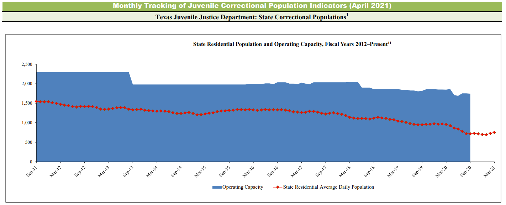

# Incarceration rate

The number of sentenced prisoners under the jurisdiction of state or federal correctional authorities per 100,000 people

## Justice & Safety

### Goal: Justice system

Texans are served effectively, efficiently, and impartially by the justice system

### Type: Secondary indicator

Updated: yes

Data Release Date: 

Comparisons: States

----

Date: 2020

Latest Value: 520

State Rank: 44

Peer Rank: 12

----

Previous Date: 2019

Previous Value: 529

Previous State Rank: 6

Previous Peer Rank: 

----
Metric Trend: up

Target: 

Baseline: 

Target Value: 

Previous Trend: 

<!--### Value

| Year |  Value      | Rank     | Previous Year   | Previous Value | Previous Rank | Trend | 
| ----------- | ----------- | ----------- | ----------- | ----------- | ----------- | -----------|
|             |             |             |             |             |             |            | 

-->
### Data

### Source

[worldpopulationreview](https://worldpopulationreview.com/state-rankings/prison-population-by-state)

[sentencingproject](https://www.sentencingproject.org/the-facts/#rankings)

[TX - LBB - Monthly Report](https://www.lbb.state.tx.us/Documents/Publications/Info_Graphic/812_MonthlyReport_FY2021.pdf)

[BJS - Federal & State Counts - 2019](https://bjs.ojp.gov/content/pub/pdf/p19.pdf)

[BJS - Federal & State Counts - 2018](https://bjs.ojp.gov/content/pub/pdf/p18.pdf)

### Notes

### Indicator Page

N/A

### DataLab Page

N/A
